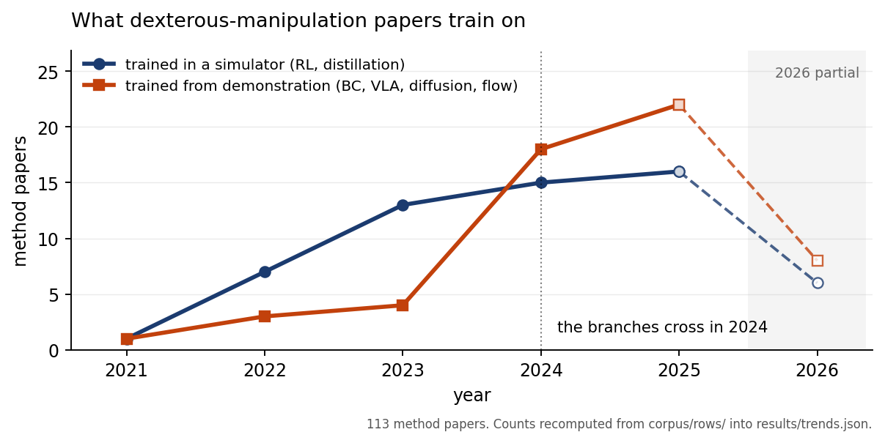

# dexmanip-survey

**A survey of learning-based dexterous manipulation, built so every claim traces to an artifact you
can open.** 113 method papers, 33 hands, 15 simulators, read into a structured corpus; the paper's
counts are recomputed from that corpus at build time rather than typed in.



## The headline

**The field changed what it trains on in 2024.** The simulator branch, reinforcement learning
on privileged state distilled to a vision student, led 13 papers to 4 in 2023 and trailed 15 to
18 in 2024. It has trailed every year since. The recipe most readers associate with this field
is its mature pipeline, not its growth area.

Every number above is in [`results/trends.json`](results/trends.json), regenerated from the
corpus by `tools/make_trend_figure.py`. The figure is drawn from the same file.

## The paper

`tex/main.pdf`, 40 pages, self-contained: appendices A to E are in it, so the posted PDF carries
every record the body argues from. `tex/main.tex` is the submission source. The Markdown edition in
`paper/` is a readable research edition assembled from the same sections; regenerate it with
`tools/assemble.py` rather than editing `paper/survey.md` directly.

[`CHANGELOG.md`](CHANGELOG.md) records every claim this survey has revised and why.

## How to run it

```sh
python3 tools/make_trend_figure.py   # results/trends.json + results/trend.png
python3 tools/assemble.py            # paper/survey.md from paper/sections/
python3 tools/check_numbers.py       # every printed number against corpus/rows/
bash    tools/build_tex.sh main      # tex/main.pdf
python3 tools/make_arxiv.py          # verified submission package
```

`check_numbers.py` is the one that matters: it recomputes every load-bearing count from
`corpus/rows/*.json` and fails if the prose disagrees with the corpus.

## What it found


Three results came out of opening the repositories and the vendor pages rather than reading the
papers alone.

Eight of the sixty-three method papers that released parseable code contradict their own paper
about the objective that was trained. Thirty-nine disagreements were recorded in total, and
the classification of every one is in the `mismatch_class` field of `corpus/rows/`.
`CHANGELOG.md` records every claim this survey has revised and why. Nine sets of authors were
written to on 19 September 2026, before the survey was posted, and each was given until 10
October 2026 to reply. One has replied: the corresponding author of `dexpoint_2022` showed that
three parts of the comparison did not hold, so that row left the count, which is why nine
letters went out and eight claims stand. Silence from the other eight is recorded as silence
rather than as agreement. Each of the eight is also stated as a comparison between two public
documents, a repository at a fetched commit against the paper's own table, which any reader can
settle without asking anyone. Section 5.6 says that beside the finding, and `outreach/` holds
the letters as they went out, with `outreach/RECIPIENTS.md` recording who each one went to and how
the address was found.

No policy here reports how far its hand sinks into the object, measured in the physics it ran
in. Twelve of the ninety-seven method rows whose notes settle it handle interpenetration at all,
five of them closed-loop policies. One of those five, D-Grasp, does report a volume for a pose its
own policy reached, and reports zero inside the simulator, because the meshes there are decimated
for speed and the number it prints comes from re-measuring one frame against the original meshes
with "no physical simulation involved". The scope of the claim matters. Grasp synthesis and
hand-object reconstruction have reported penetration depth and intersection volume comparatively
for years, so the gap is specific to learned closed-loop control, not to the field. The tooling is
not the obstacle either: NVIDIA's own benchmark repository computes per-environment maximum
interpenetration depth and gates a policy update on a one-millimetre threshold. That finding is a
null over this survey's own extraction, so the field behind it was audited by hand: 25 of the 85
rows recorded as not addressing penetration, drawn with a fixed seed and read again in their own
sources, recovered nothing, which bounds the rows that could be hiding a measurement at 8 of the 85.
The sample and a verdict per row are in `reviews/penetration_audit.md`.

Hardware and software have come apart. Thirty-three hands are tabulated, four of them appear in any
simulator's own hand models, and of the hands that can actually be bought or built from published
designs, eight appear in no method paper in this corpus.

## Layout

| directory | contents |
|---|---|
| `paper/` | `survey.md`, `sections/`, generated `tables/` and `figures/`, `METHOD.md`, the appendices, and the writing brief |
| `corpus/` | `bib.json` and the per-topic bibliographies, `rows/` with one structured record per work, the manifests with hashes and commits |
| `papers/pdf/`, `papers/md/` | downloaded sources and their parsed markdown, including `.ocr.md` where equations had to be recovered by OCR |
| `papers/notes/` | one structured note per work, written only from the parsed sources, plus the rules that govern them |
| `code/md/` | one markdown per repository: README, file tree, task and reward configs, reward and observation bodies. Clones are deleted after parsing. |
| `reviews/` | the adversarial reviews, the verification round, the claim ledger and the consistency list |
| `outreach/` | the letters to the authors of the works named for a paper-against-code disagreement, as they went out on 19 September 2026, plus `RECIPIENTS.md` recording who each went to and how the address was found; kept so a reader can see exactly what every author was asked |
| `tools/` | fetchers, parsers, and the generators for every table and figure |

## Rebuilding

```
. .venv/bin/activate
python tools/merge_bib.py           # per-topic bibliographies into corpus/bib.json
python tools/fetch_papers.py        # PDFs, then markdown, with hashes into the manifest
python tools/fetch_code.py          # shallow clones, parsed, then deleted
python tools/fetch_pages.py         # vendor pages for hands with no paper
python tools/ocr_equations.py KEY   # recover equations that render as images
python tools/check_notes.py         # note quality gate
python tools/make_tables.py tools/make_eval_tables.py tools/make_survey_table.py
python tools/make_figures.py tools/make_diagrams.py tools/make_flow_tree.py
python tools/make_appendices.py
python tools/assemble.py            # paper/survey.md
```

## Reading it critically

Start with `paper/METHOD.md`, which says what the method cannot do. The coverage statistics measure
what this survey's extraction captured, so each is a floor rather than a rate. An audit of the
nulls recovered a stated trial count from fifteen of thirty-four rows that had looked silent, which
moved that headline by nearly thirty points. Six works are behind paywalls and no claim rests on
them. Vendor specifications are manufacturer claims and are dated as such.

## The PDF

`python tools/make_pdf.py` renders `paper/survey.md` to `paper/survey.pdf`. It converts the
markdown to HTML with a print stylesheet, inlines the six figures so the file is self-contained,
drops their dark-mode rules because a printed page has one theme, puts every table of more than
five columns and the two widest figures on real landscape pages, and prints through headless
Chromium. Page numbers are stamped afterwards with PyMuPDF, because Chromium's own footer carries
a URL and a date.
# dexmanip_survey
