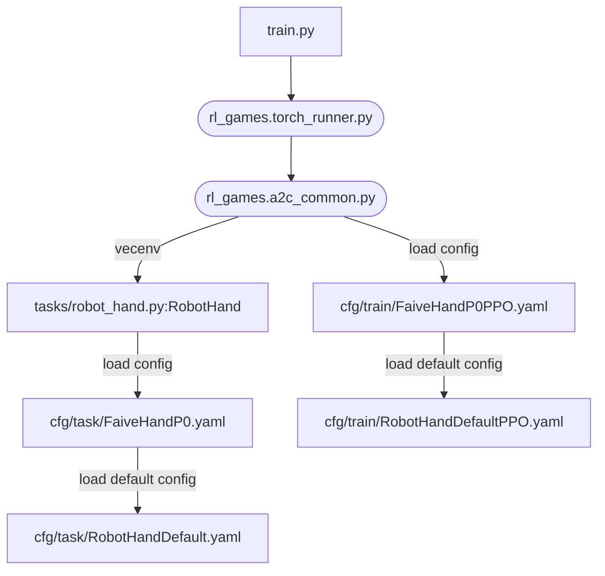

# faive_hand_2023

source: https://github.com/srl-ethz/faive_gym_oss


commit: e46ae11fe3f52619ba52284adf8a34e92ed73a14


## README

# faive_gym
IsaacGym environments for the Faive Hand (and also somewhat easily extendable to other robotic hands), intended to be used together with [IsaacGymEnvs](https://github.com/NVIDIA-Omniverse/IsaacGymEnvs)


## Resources

* [faive_gym tutorial video](https://www.youtube.com/watch?v=Nwa7xP3RtO0): A video tutorial on how to get started with the faive_gym library to train a policy with RL, configure the environment, and load your own robot model in the framework.
* [faive_gym tips document](https://docs.google.com/document/d/1n91q4nECS4vzkC2Jn62DxLiTA15WmdjJsbqNxEuv4tE/edit?usp=sharing): shared Google doc with tips on how to use the library effectively.
* [RL knowledge dump document](https://docs.google.com/document/d/1mLH4pmkmL0SE-hknsB_qGlR9QBu4GYbEzk0ho16TDC4/edit?usp=sharing): another shared Google doc with general tips about RL for manipulation

---

* [Paper (arxiv)](https://arxiv.org/abs/2308.02453): The preprint for our Humanoids 2023 paper which uses `faive_gym`. If you use this library in your work, please cite this paper.
* [Project website](https://srl-ethz.github.io/get-ball-rolling/): website introducing our Humanoids 2023 paper.
* [Project overview video](https://www.youtube.com/watch?v=YahsMhqNU8o): 3-minute video introducing our Humanoids 2023 work with the Faive Hand.

## Installation Steps

1. Install Isaac Gym
    1. Download Isaac Gym Preview 4 from the [website](https://developer.nvidia.com/isaac-gym)
	1. Check isaacgym/docs/index.html for install instructions, but this README also documents a fast way to set it up
    1. Recommended: create a conda or venv (virtual environment) Python 3.8 environment for installation. To create and activate a Python 3.8 venv,
	    1. `python3.8 -m venv ~/rlgpu` to create a new venv called "rlgpu" in the home directory. You might have to first run `sudo apt install python3.8-venv` to install the virtual environment package.
		1. `source ~/rlgpu/bin/activate` to activate the venv. You must run this to enter the venv every time a new terminal is opened.
    1. Install isaacgym with pip
	    ```bash
	    cd /path/to/isaacgym/python
	    pip install -e .
	    ```
		You might have to first run `sudo apt install python3.8-dev`.
	1. test installation
	    ```bash
		cd examples
		python joint_monkey.py
		# if you are connecting to a remote instance from Windows, GUI is not available so this command will fail- in which case you could run a non-GUI example program, e.g.
		python asset_info.py
		```
1. Install IsaacGymEnvs
    1. Clone the repository
		```bash
		git clone https://github.com/NVIDIA-Omniverse/IsaacGymEnvs
		```
		You might have to first run `sudo apt install git`.
	1. Install with pip
		```bash
		cd /path/to/IsaacGymEnvs
		pip install -e .
		```
	1. Test installation
		```bash
		cd isaacgymenvs
		python train.py
		```
	1. [optional] If an error about protobuf version appears, you may have to specify the version of protobuf, with
		```bash
		pip install --upgrade protobuf==3.20.0
		```
	1. [optional] if the error `ModuleNotFoundError: No module named 'tkinter'` appears, you must install it with
		```bash
		sudo apt install python3-tk
		```
1. Install this repository (faive_gym)
    1. Clone this repository (if you will clone the internal closed source repo, you will have to [add the SSH public key to your GitHub account](https://docs.github.com/en/authentication/connecting-to-github-with-ssh/adding-a-new-ssh-key-to-your-github-account))
		```bash
		git clone https://github.com/srl-ethz/faive_gym_oss
		# if you want to use the internal closed source repo, instead run
		git clone git@github.com:srl-ethz/faive_gym.git
		```
	1. Install with pip
		```bash
		cd /path/to/faive_gym
		pip install -e .
		```

The default Faive Hand training environment can be run with
```bash
cd /path/to/faive_gym/faive_gym
python train.py task=FaiveHandP0
```

## Additional Arguments
Some additional arguments that can be appended; This has the same effect as modifying the yaml files in faive_gym/cfg directory, and could be used to easily change hyperparameters across runs. (check IsaacGymEnvs documentation for more)

arguments | meaning
--- | --- 
capture_video=True force_render=False | occasionaly capture video while training and save it to videos/ (also uploads to W&B, if that is enabled). This also disables the windows from popping up.
capture_video_freq=2000 capture_video_len=200 | adjust the frequency / length of recording (save a video of length 200 steps every 2000 steps). If this is not set when the above arguments are set, the default settings for video capture will be used.
num_envs=8 | try with fewer robot instances (useful for debugging)
headless=True | run without GUI
test=True | no training, just rollout policy
checkpoint=runs/FaiveHand/nn/*.pth | load from checkpoint (combine with `test=True` to test out trained policy without training)
wandb_activate=True wandb_group=srl_ethz wandb_project=your_project_name wandb_name=your_run_name | log this run in Weights & Biases
task.env.env_spacing=0.7 | Any value defined in the config yaml files can be modified. This is an example of how to modify the values defined in faive_gym/cfg/task/RobotHandDefault.yaml

## using the Python `wandb` package for Weights and Biases
when using the Weights & Biases feature, there might be an error which requires you to install xvfb and ffmpeg, with `sudo apt install xvfb` and `sudo apt install ffmpeg`.

## Loading your own robotic hand model
1. Prepare a MJCF (URDF) model of your robot. **Even models that can be perfectly simulated in MuJoCo might not work in IsaacGym as IsaacGym's model conversion script does not support all modeling features**, so it might require some trial and error to adjust the model file before you can actually load it into IsaacGym.
1. within *faive_gym/cfg/task* and *faive_gym/cfg/train* directory, respectively from *FaiveHandP0.yaml* and *FaiveHandP0PPO.yaml* to create *your_robot_name.yaml* and *your_robot_namePPO.yaml* files, 
1. Modify the cfg files for your own robot in *your_robot_name.yaml*:
    - change `asset.model_file` to the path of your model file, relative to the assets/ directory.
    - `env.numActions` and the `observation.obs_dims` must be set with the degrees of freedom (DoF) for your robot
	- `observations.obs_dims.dof_pos_history` must be set to a multiple of the DoFs of your robot.
	- `asset.force_sensor_names` and `asset.pose_sensor_names` should be set to the name of the bodies at the fingertip. They are the fingertip force and pose sensors. (technically, the sensors can be placed on any body, but placing them on the fingertip would make the most sense for dexterous tasks)
	- if the number of fingers on your hand is not 5, change `observations.obs_dims.pose_sensor_*` and `observations.obs_dims.force_sensor_force` to \[number of fingers\] \* \[sensor dimension\]
1. try running train.py with your new environment, with `python train.py num_envs=2 task=your_robot_name`
    Take a good look at the error statements in the terminal and the model that appears in the window to make sure it's loaded correctly.
1. If you want to set it up for the cube rotation task, adjust the robot pose with `env.hand_start_p` and `env.hand_start_r` so that the cube falls onto the robot's palm. You can also try to adjust some other parameters defined in RobotHandDefault.yaml to suit your usage (try not to edit RobotHandDefault, just override the parameters values in your own yaml file)

## Program Structure
Grossly oversimplified diagram of how the data flows in this program after train.py (round nodes indocate programs in rl_games)



## Export a trained RL policy
This will output a .onnx and .pt file to the same directory, which can be loaded in faive_franka_control or other solutions to run the policy on the real robot.
The output files, created in the folder `faive_gym/exported_policies`, will have the names `[policy_name]_[timestamp]`, where `policy_name` is set by the `wandb_name`
parameter. The export can be ran as follows:
```bash
python export_policy.py task=FaiveHandP0 checkpoint=/path/to/checkpoint/FaiveHand.pth wandb_name=policy_name
```
To check if the `.onnx` outputs are correct, you can use [netron](https://netron.app/). An exported `.onnx` should produce the following archtiecture:


To export several models at the same time (which can be handy when testing several policies on the robot), refer to `scripts/export_all_policies.py`.


## Recording observations and joint positions for debugging
You can record all observations and joint positions for an already trained policy by running:
```
python train.py task=FaiveHandP0 headless=True test=True checkpoint=runs/FaiveHand/nn/[your_checkpoint.pth] num_envs=[env_number] task.logging.record_dofs=True task.logging.record_observations=True task.logging.record_length=[your_record_length]
```
As all environments are recorded in parallel, it is advised not to use a high number of environments - lower hundreds will work, but a high number of envs + long recordings could lead to memory issues.
The recording length is given in the number of environment steps that are recording, if you'd like to record for a certain amount of seconds, check the task.sim.dt constant.

## Other comments
If you use this library in your work, please cite:
```
@misc{toshimitsu2023getting,
	title={Getting the Ball Rolling: Learning a Dexterous Policy for a Biomimetic Tendon-Driven Hand with Rolling Contact Joints}, 
	author={Yasunori Toshimitsu and Benedek Forrai and Barnabas Gavin Cangan and Ulrich Steger and Manuel Knecht and Stefan Weirich and Robert K. Katzschmann},
	year={2023},
	eprint={2308.02453},
	archivePrefix={arXiv},
	primaryClass={cs.RO}
}
```

## File tree (depth 3, assets pruned)

```
.github/
  pull_request_template.md
.gitignore
LICENSE
LICENSE-NVIDIA
README.md
faive_gym/
  .gitignore
  __init__.py
  cfg/
    config.yaml
    task/
    train/
  robot_hand.py
  scripts/
    export_all_policies.py
    export_policy.py
  tasks/
    crawl.py
  train.py
setup.py
```

## Config files (13)


### faive_gym/cfg/config.yaml

```yaml
# Task name - used to pick the class to load
task_name: ${task.name}
# experiment name. defaults to name of training config
experiment: ''

# if set to positive integer, overrides the default number of environments
num_envs: ''

# seed - set to -1 to choose random seed
seed: 42
# set to True for deterministic performance
torch_deterministic: False

# set the maximum number of learning iterations to train for. overrides default per-environment setting
max_iterations: ''


## Device config
#  'physx' or 'flex'
physics_engine: 'physx'
# whether to use cpu or gpu pipeline
pipeline: 'gpu'
# device for running physics simulation
sim_device: 'cuda:0'
# device to run RL
rl_device: 'cuda:0'
graphics_device_id: 0

## PhysX arguments
num_threads: 4 # Number of worker threads per scene used by PhysX - for CPU PhysX only.
solver_type: 1 # 0: pgs, 1: tgs
num_subscenes: 4 # Splits the simulation into N physics scenes and runs each one in a separate thread

# RLGames Arguments
# test - if set, run policy in inference mode (requires setting checkpoint to load)
test: False
# used to set checkpoint path
checkpoint: ''
# custom to genetic_hand: if set, always start from epoch 0 no matter what epoch is in the checkpoint, useful for transfer learning from trained policy
always_start_from_epoch0: False
# set to True to use multi-gpu horovod training
multi_gpu: False

wandb_activate: False
wandb_group: 'srl_ethz'
wandb_name: ${train.params.config.name}
wandb_entity: ''
wandb_project: ''
capture_video: False
capture_video_freq: 2000
capture_video_len: 100
force_render: True

# disables rendering
headless: False

# set default task and default training config based on task
defaults:
  - task: FaiveHandP0
  - train: ${task}PPO
  - hydra/job_logging: disabled

# set the directory where the output files get saved
hydra:
  output_subdir: null
  run:
    dir: .
```

### faive_gym/cfg/task/FaiveHandP0.yaml

```yaml
# load the default environment parameters, and override the ones we want to change
defaults:
  - RobotHandDefault

# The base RobotHand class suffices for the default P0 robot for now
name: RobotHand

env:
  numActions: 11
  object_start_offset: [0, -0.15, 0.07]

asset:
  model_file: "faive_hand_p0/faive_hand.xml"
  force_sensor_names: ["index_dp", "middle_dp", "ring_dp", "pinky_dp", "thumb_dp"]
  pose_sensor_names: ["index_dp", "middle_dp", "ring_dp", "pinky_dp", "thumb_dp"]

observations:
  obs_dims:
    dof_position: 11
    dof_pos_target: 11
    dof_speed: 11
    dof_speed_numerical: 11
    dof_force: 11
    obj_pos: 3
    obj_quat: 4
    obj_linvel: 3
    obj_angvel: 3
    obj_linvel_numerical: 3
    obj_angvel_numerical: 3
    goal_pos: 3
    goal_quat: 4
    goal_quat_diff: 4
    pose_sensor_pos: 15 # 3 * 5
    pose_sensor_quat: 20  # 4 * 5 
    pose_sensor_linvel: 15  # 3 * 5
    pose_sensor_angvel: 15  # 3 * 5
    force_sensor_force: 30  # 6 * 5
    actions: 11 
    obj_pose_history: 35 # 7 dof pose * 5 history length
    dof_pos_history: 55  # 11 dof joint * 5 history length


```

### faive_gym/cfg/task/FaiveHandP0_book.yaml

```yaml
defaults:
  - FaiveHandP0
# a simple example of introducing an articulated object
# doesn't learn any actual task, feel free to improve it...

# if you want to get the joint angle of the articulated object, that can be computed by accessing the corresponding indices in self.dof_state
# e.g. if the object is 1 DoF and was loaded (with create_actor) right after the robot
# the object joint position and velocity can be accessed by self.dof_state.view(self.num_envs, -1, 2)[:, self.num_hand_dofs]
env:
  object_type: ["simple_book"]

```

### faive_gym/cfg/task/FaiveHandP0_crawl.yaml

```yaml
defaults:
  - FaiveHandP0
# use the Crawl class defined in tasks/crawl.py
# see crawl.py for how to use
# doesn't actually train, just an example of how to have a free base robot
name: Crawl
env:
  hand_fix_base: False
  hand_start_p: [0, 0, 0.1]
  hand_start_r: [0, 0, 0, 1]

  object_fix_base: True
  object_start_offset: [0, 0, 1]  # move it to where it won't interfere with hand

rewards:
  scales:
    action_penalty: 0.
    dof_acc_penalty: 0.
    dof_vel_penalty: 0.
    dof_trq_penalty: -0.0025 
    success: 0.
    drop_penalty: 0.
    simple_hand_flat: 0.0
    
    reorienttask_obj_dist: 0.
    reorienttask_obj_rot: 0.

    crawl_forward_vel: 20.
    crawl_penalty_upsidedown: -0.1

observations:
  # change to include more stuff about body
  actor_observations: ["dof_position", "dof_speed", "dof_force",
                       "hand_quat", "hand_vel",
                       "actions"]
                      
  obs_dims:
    hand_quat: 4
    hand_vel: 6
```

### faive_gym/cfg/task/FaiveHandP0_privileged.yaml

```yaml
# sample which sends different observations to the actor and critic
# since the critic can use privileged information only available to the simulator
defaults:
  - FaiveHandP0
env:
  controlFrequencyInv: 3
  
observations:
  asymmetric_observations: True
  # actor uses "history" rather than velocity, to hopefully make policy more robust to noise
  # also it does not use force observations, which are not available to the real robot (yet)
  actor_observations: ["dof_position", "dof_speed", "dof_pos_target", 
                        "obj_quat", "obj_angvel_numerical", 
                        "goal_pos", "goal_quat", "goal_quat_diff", 
                        "actions"]

  critic_observations: ["dof_position", "dof_speed", "dof_force", "dof_pos_target",
                       "obj_pos", "obj_quat", "obj_linvel", "obj_angvel_numerical",
                       "goal_pos", "goal_quat", "goal_quat_diff",
                       "pose_sensor_pos", "pose_sensor_quat", "pose_sensor_linvel", "pose_sensor_angvel", "force_sensor_force",
                       "actions"]

task:
  randomize: True
  randomization_params:
    # most params are just copied from the ShadowHandOpenAI_FF.yaml
    frequency: 2048 # Define how many simulation steps between generating new randomizations
    observations:
      range: [0, .08]  # sampled every step, regardless of "frequency". mean and variance, if distribution is "gaussian"
      range_correlated: [0, .05]  # updated every "frequency" steps, can simulate bias
      operation: "additive"
      distribution: "gaussian"
    actions:
      range: [0., .05]
      range_correlated: [0, .05]
      operation: "additive"
      distribution: "gaussian"
    actor_params:
      hand:  # this must match the name defined in create_actor
        color: True
        tendon_properties:
          damping:
            range: [0.75, 1.5]
            operation: "scaling"
            distribution: "loguniform"
          stiffness:
            range: [0.75, 1.5]
            operation: "scaling"
            distribution: "loguniform"
        dof_properties:
          damping: 
            range: [0.75, 1.5]
            operation: "scaling"
            distribution: "loguniform"
          stiffness: 
            range: [0.75, 1.5]
            operation: "scaling"
            distribution: "loguniform"
          lower:
            range: [0, 0.01]
            operation: "additive"
            distribution: "gaussian"
          upper:
            range: [0, 0.01]
            operation: "additive"
            distribution: "gaussian"
        rigid_body_properties:
          mass: 
            range: [0.75, 1.25]
            operation: "scaling"
            distribution: "uniform"
            setup_only: True # Property will only be randomized once before simulation is started. See Domain Randomization Documentation for more info.
        rigid_shape_properties:
          friction: 
            num_buckets: 250
            range: [0.75, 1.25]
            operation: "scaling"
            distribution: "uniform"
      object:  # this must match the name defined in create_actor
        scale:
          range: [0.99, 1.01]  # make the average size slightly larger to compensate for lack of silicone fingertip in simulation
          operation: "scaling"
          distribution: "uniform"
          setup_only: True
        rigid_body_properties:
          mass: 
            range: [0.75, 1.25]
            operation: "scaling"
            distribution: "uniform"
            setup_only: True
        rigid_shape_properties:
          friction:
            num_buckets: 250
            range: [0.7, 1.3]
            operation: "scaling"
            distribution: "uniform"

```

### faive_gym/cfg/task/FaiveHandP0_sphere.yaml

```yaml
defaults:
  - FaiveHandP0

# in-hand rotation of a sphere around a fixed axis
# targeted towards sim2real;
# - uses asymmetric observations where the actor only receives proprioceptive measurements
# - use lower control frequency
# - a lot of noise in the observations, action, and domain randomization
# - the task is rather sensitive to the random seed, try with 3 or 4 and use the best result?

env:
  object_type: ["sphere"]
  controlFrequencyInv: 3  # 20 Hz control
  use_relative_control: True
  relative_control_speed_scale: 6.0  # 6 rad/s max
  x_rotation_dir: 1.0 # rotation direction: positive is the same direction as TEDx
  # set the joint range that the hand hardware could actually achieve
  actuated_dof_range_override: [[0, 2.27], [-1.05, 0.698], [0, 0.567],
                                [0, 0.567], [0, 0.742],
                                [0, 0.567], [0, 0.742],
                                [0, 0.567], [0, 0.742],
                                [0, 0.567], [0, 0.742],
                                ]

rewards:
  scales:
    action_penalty: -0.002
    dof_acc_penalty: 0
    dof_vel_penalty: 0
    dof_trq_penalty: -0.01
    success: 0
    drop_penalty: -1.
    simple_hand_flat: 0

    reorienttask_obj_dist: 0
    reorienttask_obj_rot: 0
 
    rottask_obj_xrotvel: 0.01
  success_tolerance: 0

observations:
  asymmetric_observations: True
  # use only physically possible observations
  actor_observations: ["dof_pos_history",
                       "dof_pos_target",
                       "actions"]

  critic_observations: ["dof_position", "dof_speed", "dof_force", "dof_pos_target",
                       "obj_pos", "obj_quat", "obj_linvel", "obj_angvel_numerical",
                       "pose_sensor_pos", "pose_sensor_quat", "pose_sensor_linvel", "pose_sensor_angvel", "force_sensor_force",
                       "actions"]

logging:
  rt_plt: False
  buf_len_s: 0.6
  num_rows: 1
  num_cols: 5 #  multiplication of rows and cols should be equal to the 
  # number of measurements in the measurements list below
  measurements: ["_observation_dof_position_thumb_cmc", "_observation_dof_position_thumb_mcp", "_observation_dof_position_thumb_pip", "_observation_dof_position_index_mcp", "_observation_dof_position_index_pip"]
  units: ["rad", "rad", "rad", "rad", "rad"]

# visualization settings
visualization:
  camera_pos_start: [11, 11, 0.8]
  camera_target_start: [12.5, 12.5, 0.35]
  move_camera: False
  camera_movement_vector: [.005, 0.005, 0.0]

task:
  randomize: True
  randomization_params:
    # most params are just copied from the ShadowHandOpenAI_FF.yaml
    frequency: 720  # Define how many simulation steps between generating new randomizations
    observations:
      range: [0, .08]  # sampled every step, regardless of "frequency". mean and variance, if distribution is "gaussian"
      range_correlated: [0, .05]  # updated every "frequency" steps, can simulate bias
      operation: "additive"
      distribution: "gaussian"
    actions:
      range: [0., .05]
      range_correlated: [0, .05]
      operation: "additive"
      distribution: "gaussian"
    actor_params:
      hand:  # this must match the name defined in create_actor
        color: True
        tendon_properties:
          damping:
            range: [0.3, 3.0]
            operation: "scaling"
            distribution: "loguniform"
          stiffness:
            range: [0.75, 1.5]
            operation: "scaling"
            distribution: "loguniform"
        dof_properties:
          damping: 
            range: [0.3, 3.0]
            operation: "scaling"
            distribution: "loguniform"
          stiffness: 
            range: [0.75, 1.5]
            operation: "scaling"
            distribution: "loguniform"
          lower:
            range: [0, 0.01]
            operation: "additive"
            distribution: "gaussian"
          upper:
            range: [0, 0.01]
            operation: "additive"
            distribution: "gaussian"
        rigid_body_properties:
          mass: 
            range: [0.5, 1.5]
            operation: "scaling"
            distribution: "uniform"
            setup_only: True # Property will only be randomized once before simulation is started. See Domain Randomization Documentation for more info.
        rigid_shape_properties:
          friction: 
            num_buckets: 250
            range: [0.7, 1.3]
            operation: "scaling"
            distribution: "uniform"
      object:  # this must match the name defined in create_actor
        scale:
          # shift the range a bit towards the small size because other spherical objects are smaller than gacha ball
          range: [0.92, 1.05]
          operation: "scaling"
          distribution: "uniform"
          setup_only: True
        rigid_body_properties:
          mass: 
            range: [0.5, 1.5]
            operation: "scaling"
            distribution: "uniform"
            setup_only: True
        rigid_shape_properties:
          friction:
            num_buckets: 250
            range: [0.7, 1.3]
            operation: "scaling"
            distribution: "uniform"

```

### faive_gym/cfg/task/RobotHandDefault.yaml

```yaml
# Define the default configuration for the RobotHand task.
# configurations for other robotic hands can be defined by first inheriting from this config (see FaiveHandP0.yaml for an example)

# define in child config- the name of the Python VecTask class used
name: None

physics_engine: ${..physics_engine}

# if given, will override the device setting in gym.
env: 
  numEnvs: ${resolve_default:4096,${...num_envs}}
  numObservations: None  # this will be overwritten in robot_hand.py
  numStates: None  # this will be overwritten in robot_hand.py
  numActions: None  # define in child config
  env_spacing: 0.2
  episode_length_s: 10  # episode length in seconds
  aggregate_mode: True  # provides a "modest performance boost", see isaacgym/docs/programming/physics.html

  object_type: ["block"]  # block, egg, pen, sphere, ... (check asset_files_dict of robot_hand.py for all options)
  use_relative_control: False
  relative_control_speed_scale: 5.0  # 5 rad/s max joint rotation speed

  enable_debug_viz: False
  # for contact viz to work, CPU pipeline must be used, and contact_collection must be set to 1 or 2 (there are assertions in the code that ensure this)
  enable_contact_viz: False

  controlFrequencyInv: 1  # how many steps to skip between control updates (i.e. decimation)
  hand_friction: 1.0  # this sets the friction and torsion_friction of the hand. 1.0 is the default value used for trifinger.
  object_start_offset: [0, 0, 0]  # position of object initial position, relative to the hand
  actuated_dof_range_override: None  # optionally use a smaller joint range of actuation, helpful if the real robot can't achieve the full range of motion

  # whether to fix objects in the world, or let them loose
  object_fix_base: False
  hand_fix_base: True

  # hand start pose position (x, y, z)
  hand_start_p: [0, 0, 0.5]
  # hand start pose quaternion (x, y, z, w)
  # rotate 200 degrees around x axis to make palm face up, and slightly tilt it downwards
  hand_start_r: [0.9848078, 0, 0, -0.1736482]

asset:
  # define in child config- the robot model filepath, relative to assets directory
  model_file: None  
  # define in child config- body name that each force and pose sensor are attached to
  # (usually the fingertips)
  force_sensor_names: []
  pose_sensor_names: []


logging:
  # Defines the properties of online logging.
  rt_plt: False
  record_dofs: False
  record_observations: False
  record_length: 10
  buf_len_s: 0.6
  num_rows: 2
  num_cols: 3 #  multiplication of rows and cols should be equal to the 
  # number of measurements in the measurements list below
  measurements: ["_observation_dof_position_stat_thumb_mcp",
      "_observation_dof_speed_middle_pip",
      "_observation_dof_force_pinky_mcp",
      "_reward_dist_stat",
      "_observation_fingertip_force_stat_thumb",
      "_observation_obj_angvel_stat",
      ]
  units: ["rad", 
      "rad/s",
      "Nm",
      "-",
      "m",
      "m"]

rewards:
  scales:
    # These are read in faive_hand.py (_prepare_reward function) and the
    # corresponding reward functions (with the name "_reward_{name}")
    # are called


    action_penalty: -0.000002
    dof_acc_penalty: 0.0  # -0.0000001
    dof_vel_penalty: 0.0  # -0.00001
    dof_trq_penalty: 0.0
    success: 3.0
    drop_penalty: -0.0001
    simple_hand_flat: 0.0
    
    reorienttask_obj_dist: -0.05
    reorienttask_obj_rot: 0.01

  success_tolerance: 0.1
  fall_dist_threshold: 0.5

actions:
  clip: True
  clip_value: 1.0

observations:
  clip: True
  clip_value: 5.0

  obs_dims: None
  # define in child config (because each robot has different DoFs)- the observation names and dimensions 
  # this is used to determine the size of the observation buffer

  obs_scales:
    # Optionally define how much each observation should be scaled
    # if not given, the default value value of 1.0 is used.
    # Even if the scale is not specified here,
    # rl_games has a running normalizer (rl_games/algos_torch/running_mean_std.py)
    # which tries to normalize observations before sending them to the network.
    # Tuning this will probably not drastically improve the performance!
    dof_position: 2.0
    dof_speed: 0.25
    dof_force: 5.0
    obj_pos: 4.0
    obj_quat: 2.0
    obj_linvel: 10.0
    obj_angvel: 0.4
    goal_pos: 4.0
    goal_quat: 2.0
    goal_quat_diff: 2.0
    pose_sensor_pos: 5.0
    pose_sensor_quat: 1.0
    pose_sensor_linvel: 3.0
    pose_sensor_angvel: 0.2
    force_sensor_force: 4.0
    actions: 1.3
    obj_pose_history: 3.0
    dof_pos_history: 2.0
    obj_type: 1.0


  # if True, feed different observations to the actor and critic (e.g. when you want to send privileged information to the critic)
  # otherwise, the actor_observations is used for both actor and critic
  asymmetric_observations: False
  actor_observations: ["dof_position", "dof_speed", "dof_force",
                       "obj_pos", "obj_quat", "obj_linvel", "obj_angvel",
                       "goal_pos", "goal_quat", "goal_quat_diff",
                       "pose_sensor_pos", "pose_sensor_quat", "pose_sensor_linvel", "pose_sensor_angvel", "force_sensor_force",
                       "actions"]

  

  # used only in student training (student_train.py) - what observations are given to the student
  student_observations: ["dof_position", "dof_speed", "dof_force",
                         "obj_pos", "obj_quat", "obj_linvel", "obj_angvel",
                         "goal_pos", "goal_quat", "goal_quat_diff",
                         "actions"]

visualization:
  camera_pos_start: [-0.5, -0.5, 0.6]
  camera_target_start: [0, 0, 0.5]
  move_camera: False    # set to true if you want cool camera motion
  camera_movement_vector: [.005, 0.005, 0.0]
 
reset_noise:
  # how much noise to add to various dofs when resetting
  object_pos: 0.01
  object_rot: 0.0
  dof_pos: 0.2  # ratio wrt range of motion
  dof_vel: 0.0

task:
  randomize: False

sim:
  dt: 0.01667  # 60 Hz
  substeps: 2
  gravity: [0, 0, -9.81]
  up_axis: "z"  # 0 is y, 1 is z
  use_gpu_pipeline: ${eq:${...pipeline},"gpu"}

  physx:
    num_threads: 4  # Number of worker threads per scene used by PhysX - for CPU PhysX only.
    solver_type: 1  # 0: pgs, 1: tgs
    num_position_iterations: 8
    num_velocity_iterations: 0
    max_gpu_contact_pairs: 8388608  # 8*1024*1024
    num_subscenes: 4  # Splits the simulation into N physics scenes and runs each one in a separate thread
    contact_offset: 0.002
    rest_offset: 0.0
    bounce_threshold_velocity: 0.2
    max_depenetration_velocity: 1000.0
    default_buffer_size_multiplier: 5.0
    contact_collection: 0  # 0: CC_NEVER (don't collect contact info), 1: CC_LAST_SUBSTEP (collect only contacts on last substep), 2: CC_ALL_SUBSTEPS (default - all contacts)


```

### faive_gym/cfg/train/FaiveHandP0PPO.yaml

```yaml
defaults:
  - RobotHandDefaultPPO
```

### faive_gym/cfg/train/FaiveHandP0_bookPPO.yaml

```yaml
defaults:
  - FaiveHandP0PPO
```

### faive_gym/cfg/train/FaiveHandP0_crawlPPO.yaml

```yaml
defaults:
  - FaiveHandP0PPO
```

### faive_gym/cfg/train/FaiveHandP0_privilegedPPO.yaml

```yaml
defaults:
  - FaiveHandP0PPO

params:
  config:
    central_value_config:
      # "Central Value Network" rl_games' name for the critic, when it has to receive a separate set of observations from the actor.
      # by defining the central_value_config, the central value is enabled, and rl_games reads from the state_buf for the critic observations and obs_buf for the actor observations.
      minibatch_size: ${..minibatch_size}
      mini_epochs: 5
      learning_rate: 5e-4
      lr_schedule: adaptive
      schedule_type: standard
      kl_threshold: 0.016
      clip_value: True
      normalize_input: True
      truncate_grads: True

      network:
        name: actor_critic
        central_value: True
        mlp:
          units: [512, 512, 256, 128]
          activation: elu
          d2rl: False
          initializer:
            name: default
          regularizer:
            name: None
```

### faive_gym/cfg/train/FaiveHandP0_spherePPO.yaml

```yaml
defaults:
  - FaiveHandP0PPO
  
# enable asymmetric observations
params:
  config:
    central_value_config:
      minibatch_size: ${..minibatch_size}
      mini_epochs: 5
      learning_rate: 5e-4
      lr_schedule: adaptive
      schedule_type: standard
      kl_threshold: 0.016
      clip_value: True
      normalize_input: True
      truncate_grads: True

      network:
        name: actor_critic
        central_value: True
        mlp:
          units: [512, 512, 256, 128]
          activation: elu
          d2rl: False
          initializer:
            name: default
          regularizer:
            name: N
```

### faive_gym/cfg/train/RobotHandDefaultPPO.yaml

```yaml
# Define the default training configuration for the RobotHand task.
# configurations for other robotic hands can be defined by first inheriting from this config (see FaiveHandP0PPO.yaml for an example)

params:
  seed: ${...seed}

  algo:
    name: a2c_continuous

  model:
    name: continuous_a2c_logstd

  network:
    name: actor_critic
    separate: False

    space:
      continuous:
        mu_activation: None
        sigma_activation: None
        mu_init:
          name: default
        sigma_init:
          name: const_initializer
          val: 0
        fixed_sigma: True

    mlp:
      units: [512, 512, 256, 128]
      activation: elu
      d2rl: False

      initializer:
        name: default
      regularizer:
        name: None

  load_checkpoint: ${if:${...checkpoint},True,False} # flag which sets whether to load the checkpoint
  load_path: ${...checkpoint} # path to the checkpoint to load

  config:
    name: ${resolve_default:FaiveHand,${....experiment}}
    full_experiment_name: ${.name}
    env_name: rlgpu
    multi_gpu: ${....multi_gpu}
    ppo: True
    mixed_precision: False
    normalize_input: True
    normalize_value: True
    value_bootstrap: True
    num_actors: ${....task.env.numEnvs}
    normalize_advantage: True
    gamma: 0.99
    tau: 0.95
    learning_rate: 5e-4
    lr_schedule: adaptive
    schedule_type: standard
    kl_threshold: 0.016
    score_to_win: 100000
    max_epochs: ${resolve_default:5000,${....max_iterations}}
    save_best_after: 100
    save_frequency: 200
    print_stats: True
    grad_norm: 1.0
    entropy_coef: 0.0
    truncate_grads: True
    e_clip: 0.2
    horizon_length: 8
    minibatch_size: ${....task.env.numEnvs}
    mini_epochs: 5
    critic_coef: 4
    clip_value: True
    seq_len: 4
    bounds_loss_coef: 0.0001
    reward_shaper:
      scale_value: 1

    player:
      #render: True
      deterministic: True
      games_num: 100000
      print_stats: True

# custom to faive-isaac, parameters for training the student policy
student:
  learning_rate: 1e-5
  # how many hiddent units the student policy has before it gets sent to the layers copied from the teacher
  custom_layers_units: [512, 256, 128]
  # how many layers to copy from the end of the teacher policy to the end of the student policy
  num_layers_to_copy_from_teacher: 2
```

## Python signatures and reward/observation bodies (4 files)


### faive_gym/robot_hand.py

```
def class_to_dict(obj)
class RobotHand(VecTask)
    def __init__(self, cfg, rl_device, sim_device, graphics_device_id, headless, virtual_screen_capture, force_render)
    def _init_buffers(self)
    def pre_physics_step(self, actions)
    def post_physics_step(self)
    def record_step(self)
    def check_termination(self)
    def reset_goal_states(self, env_ids)
    def reset_object_states(self, env_ids)
    def custom_reset(self)
    def reset_idx(self, env_ids, goal_env_ids)
    def reset(self)
    def _prepare_reward_function(self)
    def _prepare_observations(self)
    def _prepare_logged_functions(self)
    def _get_observation_to_log(self, obs_function, env_idx, obs_name, num_lines, obs_idx)
    def compute_reward(self)
    def _fill_obs(self, obs_tensor, obs_names, obs_functions)
    def compute_observations(self)
    def get_logs(self)
    def create_sim(self)
    def _create_ground_plane(self)
    def _create_envs(self)
    def _parse_cfg(self, cfg)
    def _draw_sphere(self, env_idx, x, y, z, radius, color)
    def _draw_frame_axes(self, env_idx, pos, rot, ax_len)
    def _reward_dof_acc_penalty(self)
    def _reward_dof_vel_penalty(self)
    def _reward_action_penalty(self)
    def _reward_dof_trq_penalty(self)
    def _reward_success(self)
    def _reward_drop_penalty(self)
    def _reward_simple_hand_flat(self)
    def _reward_reorienttask_obj_dist(self)
    def _reward_reorienttask_obj_rot(self)
    def _reward_rottask_obj_xrotvel(self)
    def _observation_dof_position(self)
    def _observation_dof_pos_target(self)
    def _observation_obj_type(self)
    def _observation_obj_pose_history(self)
    def _observation_dof_pos_history(self)
    def _observation_dof_speed(self)
    def _observation_dof_speed_numerical(self)
    def _observation_dof_force(self)
    def _observation_obj_pos(self)
    def _observation_obj_quat(self)
    def _observation_obj_linvel(self)
    def _observation_obj_angvel(self)
    def _observation_obj_linvel_numerical(self)
    def _observation_obj_angvel_numerical(self)
    def _observation_goal_pos(self)
    def _observation_goal_quat(self)
    def _observation_goal_quat_diff(self)
    def _observation_pose_sensor_pos(self)
    def _observation_pose_sensor_quat(self)
    def _observation_pose_sensor_linvel(self)
    def _observation_pose_sensor_angvel(self)
    def _observation_force_sensor_force(self)
    def _observation_actions(self)
def randomize_rotation(rand0, rand1, x_unit_tensor, y_unit_tensor)

```python
def _prepare_reward_function(self):
        """
        Prepare a list of reward functons, which will be called to compute the total reward
        looks for self._reward_<REWARD_NAME>, where <REWARD_NAME> are the nonzero entries in self.cfg["rewards"]["scales"]
        """
        # prepare list of reward functions
        self.reward_functions = []
        self.reward_names = []
        for name, _ in self.reward_scales.items():
            self.reward_names.append(name)
            func_name = "_reward_" + name
            # find member function with name func_name
            try:
                self.reward_functions.append(getattr(self, func_name))
            except AttributeError:
                raise AttributeError(
                    f"Reward function {func_name} not found, remove reward {name} or implement member function {func_name}"
                )
        # init dict for logging each reward value (averaged across all environments) separately
        self.rewards_dict = {}
```

```python
def _prepare_observations(self):
        """
        Prepare a list of observation functons, which will be called to compute the full observation
        looks for self._observation_<OBSERVATION_NAME>, where <OBSERVATION_NAME> are the entries defined
        in actor_observations (and critic_observations, if asymmetric_observations is set to True)
        returns the observation dimension for the actor and critic (latter is 0 if asymmetric_observations is False)
        """

        def collect_observation_functions_compute_dim(obs_names):
            """
            create a list of the observation functions for the list obs_names,
            and also compute the total dimension of that set of observations
            """
            obs_functions = []
            obs_dim = 0
            for obs_name in obs_names:
                try:
                    obs_dim += self.obs_dims[obs_name]
                except KeyError:
                    raise KeyError(f"could not find obs_dims for observation {obs_name}, check config file")
                func_name = "_observation_" + obs_name
                # find member function with name func_name
                try:
                    obs_functions.append(getattr(self, func_name))
                except AttributeError:
                    raise AttributeError(
                        f"Observation function {func_name} not found, remove observation {obs_name} or implement member function {func_name}"
                    )
            return obs_functions, obs_dim

        self.actor_obs_functions, actor_obs_dim = collect_observation_functions_compute_dim(
            self.cfg["observations"]["actor_observations"]
        )
        if self.cfg["observations"]["asymmetric_observations"]:
            self.critic_obs_functions, critic_obs_dim = collect_observation_functions_compute_dim(
                self.cfg["observations"]["critic_observations"]
            )
        else:
            critic_obs_dim = 0
        return actor_obs_dim, critic_obs_dim
```

```python
def _get_observation_to_log(self, obs_function, env_idx, obs_name, num_lines, obs_idx = None):
        """
        Calls the observation function and returns the observation to log
        """
        #print("Getting obs ", obs_name, " for env ", env_idx, " with idx ", obs_idx, " and num_lines ", num_lines)
        obs_tensor = obs_function()
        if "_stat" in obs_name:
                #print(obs_tensor.shape)
                if obs_idx is None:
                    if num_lines == 2:
                        return [torch.mean(obs_tensor).item(), torch.std(obs_tensor).item()]
                    else:
                        values = []
                        for i in range(num_lines//2):
                            values += [torch.mean(obs_tensor, dim=0)[i].item(), 
                                torch.std(obs_tensor, dim=0)[i].item()]
                        return values
                else:
                    if "pos" in obs_name and "dof" in obs_name:
                        pos_mean = torch.mean(obs_tensor, dim=0)[obs_idx].item()
                        target_mean = torch.mean(self.cur_targets, dim=0)[obs_idx].item()
                        pos_std = torch.std(obs_tensor, dim=0)[obs_idx].item()
                        target_std = torch.std(self.cur_targets, dim=0)[obs_idx].item()
                        return [pos_mean, target_mean, pos_std, target_std]
                    elif "fingertip" in obs_name:
                        values = []
                        for i in range(num_lines//2):
                            values += [
                                torch.mean(obs_tensor, dim=0)[obs_idx*5+i].item(),
                                torch.std(obs_tensor, dim=0)[obs_idx*5+i].item()
                            ]
                        return values
                    elif "proxim" in obs_name:
                        values = []
                        for i in range(num_lines//2):
                            values += [
                                torch.mean(obs_tensor, dim=0)[obs_idx*5+i].item(),
                                torch.std(obs_tensor, dim=0)[obs_idx*5+i].item()
                            ]
                        return values
                    else:
                        return [
                            torch.mean(obs_tensor, dim=0)[obs_idx].item(),
                            torch.std(obs_tensor, dim=1)[obs_idx].item()
                        ]
        else:
            if obs_idx is None:
                if num_lines == 1:
                    return obs_tensor[env_idx].item()
                else:
                    return [obs_tensor[env_idx,i].item() for i in range(num_lines)]
            else:
                if "pos" in obs_name and "dof" in obs_name:
                    pos = self.hand_dof_pos[:, self.actuated_dof_indices][env_idx, obs_idx].item()
                    target = self.cur_targets[:, self.actuated_dof_indices][env_idx, obs_idx].item()
                    return [pos, target]
                elif "fingertip" in obs_name:
                    #print("Taking idx ", obs_idx*5, " to ", obs_idx*5+4, " from fingertip obs tensor")
                    return [obs_tensor[env_idx,obs_idx*5+i].item() for i in range(num_lines)]
                elif "proxim" in obs_name:
                    
                    return [obs_tensor[env_idx,obs_idx*5+i].item() for i in range(num_lines)]
                else:
                    return obs_tensor[env_idx, obs_idx].item()
```

```python
def compute_reward(self):
        """
        Calls each reward function which has a non-zero scale (processed in self._prepare_reward_function)
        adds each terms to the episode sums and to the total reward
        """
        self.rew_buf[:] = 0
        for reward_name, reward_func in zip(self.reward_names, self.reward_functions):
            if self.reward_scales[reward_name] == 0:
                continue  # ignore zero-scaled rewards
            reward = reward_func() * self.reward_scales[reward_name]
            self.rew_buf += reward
            self.rewards_dict[f"rew_{reward_name}"] = reward.mean()
```

```python
def compute_observations(self):
        """
        updates the observation buffer with the current observations
        """
        self._fill_obs(self.obs_buf, self.cfg["observations"]["actor_observations"], self.actor_obs_functions)
        if self.cfg["observations"]["asymmetric_observations"]:
            self._fill_obs(self.states_buf, self.cfg["observations"]["critic_observations"], self.critic_obs_functions)
        if self.cfg["observations"]["clip"]:
            clip_obs = self.cfg["observations"]["clip_value"]
            self.obs_buf = torch.clip(self.obs_buf, -clip_obs, clip_obs)
            self.states_buf = torch.clip(self.states_buf, -clip_obs, clip_obs)
```

```python
def _reward_dof_acc_penalty(self):
        """
        Penalize joint acceleration, could remove shaking
        """
        return torch.norm(self.dof_acceleration, p=2, dim=-1)
```

```python
def _reward_dof_vel_penalty(self):
        """
        Penalize speed of the joints, smooth out movement
        """
        return torch.norm(self.hand_dof_vel, p=2, dim=-1)
```

```python
def _reward_action_penalty(self):
        """
        Penalize the magnitude of the action
        """
        return torch.norm(self.actions, p=2, dim=-1)
```

```python
def _reward_dof_trq_penalty(self):
        """
        Penalize the magnitude of the joint torque
        """
        return torch.norm(self.dof_force_tensor, p=2, dim=-1)
```

```python
def _reward_success(self):
        """
        Reward the agent for success (success_buf is computed in check_termination(), its definition is different for each task)
        """
        return self.success_buf
```

```python
def _reward_drop_penalty(self):
        """
        Penalize the agent for falling over
        """
        return self.dropped_buf
```

```python
def _reward_simple_hand_flat(self):
        """
        simple reward function that rewards the joint pos being close to zero
        useful for debugging policies, since it is such an easy task
        """
        dist_from_zero = torch.norm(self.hand_dof_pos, p=2, dim=-1)
        return 1.0 / (dist_from_zero + 0.1)
```

```python
def _reward_reorienttask_obj_dist(self):
        """
        Reward the agent based on the distance between the object and the goal
        """
     
```

### faive_gym/scripts/export_policy.py

```
class ModelWrapper(Module)
    """Main idea is to ignore outputs which we don't need from model"""
    def __init__(self, model)
    def forward(self, input_dict)
def launch_rlg_hydra(cfg)
```

### faive_gym/tasks/crawl.py

```
class Crawl(RobotHand)
    def check_termination(self)
    def _init_buffers(self)
    def _reward_crawl_penalty_upsidedown(self)
    def _reward_crawl_forward_vel(self)
    def _observation_hand_quat(self)
    def _observation_hand_vel(self)

```python
def _reward_crawl_penalty_upsidedown(self):
        return self.upside_down_buf
```

```python
def _reward_crawl_forward_vel(self):
        quat = self.hand_pose[:, 3:]
        lin_vel = self.hand_vel[:, :3]
        local_vel = quat_rotate_inverse(quat, lin_vel)
        vel_error = torch.sum(torch.square(self.target_vel - local_vel), dim=1)
        return torch.exp(-vel_error/0.05)
```

```python
def _observation_hand_quat(self):
        return self.hand_pose[:, 3:]
```

```python
def _observation_hand_vel(self):
        return self.hand_vel
```
```

### faive_gym/train.py

```
def launch_rlg_hydra(cfg)
```