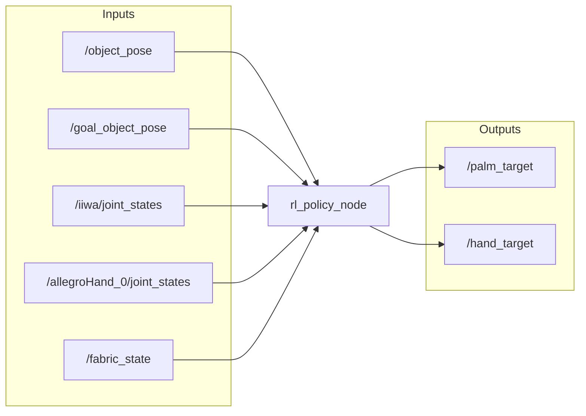
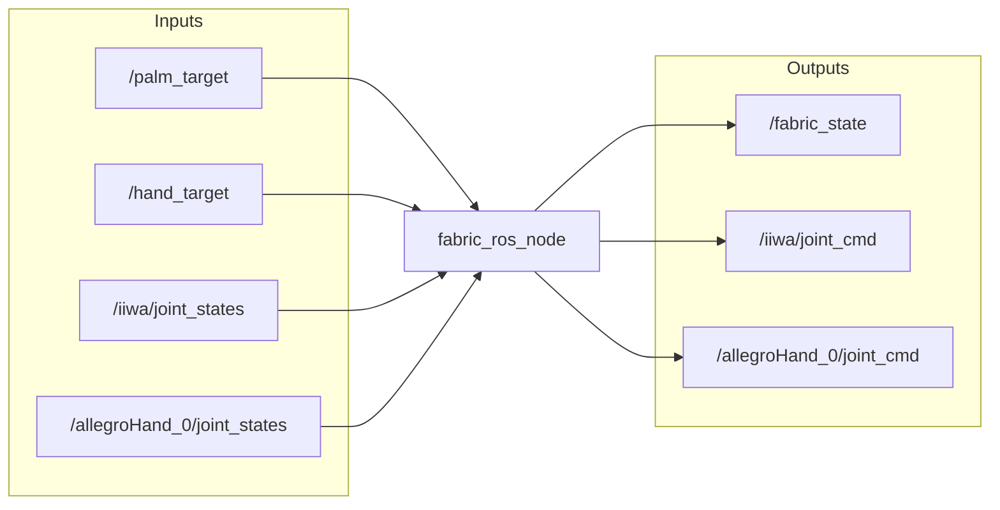
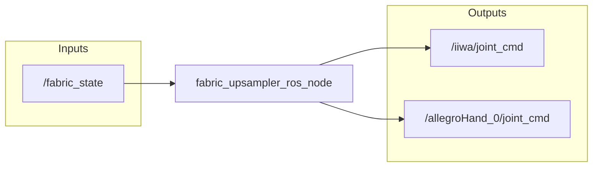

# human2sim2robot_2025

source: https://github.com/tylerlum/human2sim2robot


commit: 894eae2ec3ae39a573b81bd1860d14cc6bdfa6df


## README

# Human2Sim2Robot: Crossing the Human-Robot Embodiment Gap with Sim-to-Real RL using One Human Demonstration

[Project Page](https://human2sim2robot.github.io/)

<!--  -->

https://github.com/user-attachments/assets/c9f75100-06fd-4f5f-8631-3ccdacab46d1

# Overview

This repository contains the official implementation of the Human2Sim2Robot framework, which was introduced in _Crossing the Human-Robot Embodiment Gap with Sim-to-Real RL using One Human Demonstration_. It consists of:

* Real-to-Sim: Digital twin creation for the robot, environment, and objects.

* Human Video Demonstration: Data collection and processing.

* Simulation-based Policy Learning: RL training in simulation to learn dexterous manipulation policies.

* Sim-to-Real: Policy deployment in the real world.

# Project Structure

```
human2sim2robot
  ├── assets
  │   └── // Assets such as robot URDF files, object models, etc.
  ├── data
  │   └── // Store raw video demos, processed demo data, etc.
  ├── docs
  │   └── // Documentation
  ├── pretrained_models
  │   └── // Pretrained models
  ├── runs
  │   └── // Simulation-based policy learning training runs
  └── human2sim2robot
      ├── // Source code
      └── hardware_deployment
      │  └── // Sim-to-real hardware deployment of policy
      └── human_demo
      │  └── // Human video demo collection and processing
      └── ppo
      │  └── // PPO training and evaluation
      └── real_to_sim
      │  └── // Real-to-sim digital twin creation
      └── sim_training
      │  └── // Simulation-based policy learning
      └── utils
         └── // Shared utilities
```

# Installation

Please see the [Installation](docs/installation.md) documentation for more details.

# Quick Start

Please run all commands from the root directory of this repository.

## Setup Zsh Tab Completion (Optional + Experimental + Fun)

For most scripts in this codebase, you can add `--help` after the script filepath to get the commandline arguments.

You can run commands even faster with tab completion. Run this to get tab completion for most scripts in this codebase. This is experimental and only works for `zsh` (not `bash`). This is just a small quality of life improvement, so feel free to skip it!

### Tyro Tab Completion
One-time run to set up tab completion (takes a minute):
```
python human2sim2robot/utils/setup_zsh_tab_completion.py
```

Run this in every new session (or put in `~/.zshrc` with the proper path):
```
fpath+=`pwd`/.zsh_tab_completion
autoload -Uz compinit && compinit
```

Now, for most scripts in the database, you will have tab autocompletion. For example:

```
python human2sim2robot/utils/download.py \
-
```

After the script filepath, you can enter a `-` and then press "TAB" to get auto-completion!

Note that this does not apply for the sim training script, which uses `hydra`.

### Hydra

For the sim training script, enable tab completion of commandline arguments by running the following (or putting this into your `.zshrc` with the proper path):

```
eval "$(python human2sim2robot/sim_training/run.py -sc install=bash)"
```

For example:

```
python human2sim2robot/sim_training/run.py \
te
```

You can now press "TAB" to get auto-completion!

WARNING: These two tab completions seem to conflict with each other. Thus, only use one at a time. Sorry :(

## Download Files

Fill out this [form](https://forms.gle/rUfrbuzKHW5BexcH6) to download the Human2Sim2Robot assets, data, and pretrained models. After filling out this form, you will receive a URL `<download_url>`, which will be used next.

NOTE: Navigating to `<download_url>` will take you to a forbidden page. This is expected. We use it in the steps below by setting this environment variable:

```
export DOWNLOAD_URL=<download_url>
```

First, we will download the assets, human demo raw data (all tasks), human demo processed data (all tasks), and pretrained models:

```
python human2sim2robot/utils/download.py \
--download_url ${DOWNLOAD_URL} \
--include_assets \
--all_tasks \
--include_human_demo_raw_data \
--include_human_demo_processed_data \
--include_pretrained_models
```

This should create folders for `assets`, `data/human_demo_raw_data/`, `data/human_demo_processed_data/`, and `pretrained_models`. To choose a specific task, you can replace `--all_tasks` with `--task_name <TASK_NAME>` (e.g., `snackbox_push`, `plate_pivotliftrack`).

## Real-to-Sim Digital Twin Creation

The goal of this section is to create a digital twin of the robot, objects, camera, and environment. The details for this section can be found in the [Real-to-Sim](human2sim2robot/real_to_sim/README.md) documentation.

Note that you can skip this section and simply use the provided digital twins in `assets/`.

## Human Demonstration

The goal of this section is to collect human video demonstrations of a task. The details for this section can be found in the [Human Demonstration](human2sim2robot/human_demo/README.md) documentation.

Note that you can skip this section and simply use the provided data in `data/human_demo_raw_data/` and `data/human_demo_processed_data/`.

For example:
```
export TASK_NAME=snackbox_push  # You can replace this with your task name (plate_pivotliftrack)
export OBJ_PATH=assets/kiri/snackbox/snackbox.obj  # You can replace this with your object obj path (assets/ikea/plate/plate.obj)
export FPS=30  # You can replace this with your FPS
```

You should have the following structure:

```
data/
├── human_demo_processed_data
│   └── $TASK_NAME
│       ├── hand_pose_trajectory
│       ├── object_pose_trajectory
│       └── retargeted_robot.npz
└── human_demo_raw_data
    └── $TASK_NAME
        ├── depth
        ├── rgb
        ├── masks
        ├── hand_masks
        └── cam_K.txt
```

You can run the following to create videos to visualize the data:

```
export VIDEOS_DIR=data/human_demo_videos/$TASK_NAME
mkdir -p $VIDEOS_DIR

# RGB
ffmpeg \
-framerate $FPS \
-i data/human_demo_raw_data/$TASK_NAME/rgb/%05d.png \
-c:v libx264 \
-pix_fmt yuv420p \
$VIDEOS_DIR/rgb.mp4

# Depth
ffmpeg \
-framerate $FPS \
-i data/human_demo_raw_data/$TASK_NAME/depth/%05d.png \
-c:v libx264 \
-pix_fmt yuv420p \
$VIDEOS_DIR/depth.mp4

# Object Masks
ffmpeg \
-framerate $FPS \
-i data/human_demo_raw_data/$TASK_NAME/masks/%05d.png \
-c:v libx264 \
-pix_fmt yuv420p \
$VIDEOS_DIR/masks.mp4

# Hand Masks
ffmpeg \
-framerate $FPS \
-i data/human_demo_raw_data/$TASK_NAME/hand_masks/%05d.png \
-c:v libx264 \
-pix_fmt yuv420p \
$VIDEOS_DIR/hand_masks.mp4

# Object Pose Trajectory
ffmpeg \
-framerate $FPS \
-i data/human_demo_processed_data/$TASK_NAME/object_pose_trajectory/track_vis/%05d.png \
-c:v libx264 \
-pix_fmt yuv420p \
$VIDEOS_DIR/object_pose_trajectory.mp4

# Hand Pose Trajectory
ffmpeg \
-framerate $FPS \
-i data/human_demo_processed_data/$TASK_NAME/hand_pose_trajectory/%05d.png \
-c:v libx264 \
-pix_fmt yuv420p \
$VIDEOS_DIR/hand_pose_trajectory.mp4
```

https://github.com/user-attachments/assets/484499ce-6256-4e2c-bd3f-b2c9bcd13678

Visualize the human demonstration in a 3D viewer (with only hand keypoints instead of full hand meshes):
```
python human2sim2robot/human_demo/visualize_demo.py \
--obj-path $OBJ_PATH \
--object-poses-dir data/human_demo_processed_data/$TASK_NAME/object_pose_trajectory/ob_in_cam \
--hand-poses-dir data/human_demo_processed_data/$TASK_NAME/hand_pose_trajectory/ \
--visualize-table
```

https://github.com/user-attachments/assets/e6d2d8b1-ec9a-4202-8b51-8710271d6178

Visualize the human demonstration in a 3D viewer (with full hand meshes, which is slower to load):
```
python human2sim2robot/human_demo/visualize_demo.py \
--obj-path $OBJ_PATH \
--object-poses-dir data/human_demo_processed_data/$TASK_NAME/object_pose_trajectory/ob_in_cam \
--hand-poses-dir data/human_demo_processed_data/$TASK_NAME/hand_pose_trajectory/ \
--visualize-table \
--visualize-hand-meshes  # This makes things slower to load, but you can see the full hand mesh
```

https://github.com/user-attachments/assets/4da1ed53-a75a-45e7-9737-eccde026b2e3

Visualize the human demonstration and the robot retargeted trajectory in a 3D viewer:
```
python human2sim2robot/human_demo/visualize_demo.py \
--obj-path $OBJ_PATH \
--object-poses-dir data/human_demo_processed_data/$TASK_NAME/object_pose_trajectory/ob_in_cam \
--hand-poses-dir data/human_demo_processed_data/$TASK_NAME/hand_pose_trajectory/ \
--visualize-table \
--robot-file iiwa_allegro.yml \
--retargeted-robot-file data/human_demo_processed_data/$TASK_NAME/retargeted_robot.npz \
--visualize-transforms
```

https://github.com/user-attachments/assets/26eb7b37-cdce-4a75-9aba-b1445d4ae5e6


## Simulation-based Policy Learning

https://github.com/user-attachments/assets/8832f9b8-aecb-4950-a6b6-3a6ce49dd384

https://github.com/user-attachments/assets/5dfe16dc-809e-40a0-ad71-298759c60302

The goal of this section is to train a policy in simulation using the processed human demonstration data and evaluate these policies in simulation. The details for this section can be found in the [Sim Training](human2sim2robot/sim_training/README.md) documentation.

For this step, you need data in `data/human_demo_processed_data/` as described above.


### Testing a Pre-trained Policy

If you have a pre-trained policy in the following directory:

```
export PRETRAINED_POLICY_DIR=pretrained_models/Experiment_snackbox_push_2025-03-28_10-33-38-374687
```

```
$PRETRAINED_POLICY_DIR
├── config_resolved.yaml
├── config.yaml
├── log.txt
└── nn
    └── best.pth
```

To test this pre-trained policy, run the following:

```
python human2sim2robot/sim_training/run.py \
--config-path ../../$PRETRAINED_POLICY_DIR \
--config-name config \
device_id=0 \
graphics_device_id=0 \
test=True \
num_envs=1 \
train.player.deterministic=False \
headless=False \
task.sim.enable_viewer_sync_at_start=True \
task.env.custom.enableDebugViz=False \
task.randomize=False \
checkpoint=$PRETRAINED_POLICY_DIR/nn/best.pth
```

Note that we have the `../../` because when we specify this config path as a relative path, it needs to be relative to the `sim_training` directory. If you specify the config path as an absolute path, you can remove the `../../`.

You can also run this other pretrained policy:

```
export PRETRAINED_POLICY_DIR=pretrained_models/Experiment_plate_pivotliftrack_2025-03-28_17-08-54-978176
```

From the simulator, you can press "R" to reset the environment and "E" to visualize debug visualizations.

### Training a New Policy

To train a policy, run the following:

```
export URDF_PATH=assets/kiri/snackbox/snackbox.urdf  # You can replace this with your object urdf path
export TASK_NAME=snackbox_push  # You can replace this with your task name
```

```
python human2sim2robot/sim_training/run.py \
task=CrossEmbodiment \
train=CrossEmbodimentPPOLSTM \
experiment=Experiment_$TASK_NAME \
wandb_group=my_wandb_group \
task.env.custom.ENABLE_FABRIC_COLLISION_AVOIDANCE=True \
task.env.custom.FABRIC_CSPACE_DAMPING=65 \
task.env.custom.FABRIC_CSPACE_DAMPING_HAND=5 \
task.env.controlFrequencyInv=4 \
task.env.custom.USE_CUROBO=True \
task.randomize=True \
randomization_params=RandomizationParams_medium \
task.env.custom.object_urdf_path=$URDF_PATH \
task.env.custom.retargeted_robot_file=data/human_demo_processed_data/$TASK_NAME/retargeted_robot.npz \
task.env.custom.object_poses_dir=data/human_demo_processed_data/$TASK_NAME/object_pose_trajectory/ob_in_cam \
headless=True \
device_id=0 \
graphics_device_id=0
```

You can remove `task.randomize=True` and `randomization_params=RandomizationParams_medium` if you want to train a policy without domain randomization.

This will train a policy and save the results in `runs/<experiment>_<timestamp>`, and this policy can be tested similar to above, but change:

```
export PRETRAINED_POLICY_DIR=runs/<experiment>_<timestamp>
```

You can also train using this different task:
```
export URDF_PATH=assets/ikea/plate/plate.urdf  # You can replace this with your object urdf path
export TASK_NAME=plate_pivotliftrack  # You can replace this with your task name
```

If you are using wandb, you can easily test a policy you see there by opening the associated run, go to "Overview", and then copy the command. Then go to "Files", then "runs", then `<experiment>_<timestamp>`, then "nn", then "best.pth", and then copy the URL. We put this together and add/remove some key arguments for testing.

```
test=True \
num_envs=1 \
train.player.deterministic=False \
headless=False \
task.sim.enable_viewer_sync_at_start=True \
task.env.custom.enableDebugViz=False \
checkpoint="https://wandb.ai/tylerlum/cross_embodiment/groups/my_wandb_group/files/runs/Experiment_snackbox_push_2025-03-27_11-16-39-387984/nn/best.pth\?runName\=Experiment_snackbox_push_2025-03-27_11-16-39-387984_v491d1sj"
```

Note that the URL is surrounded by double quotes, and the "?" and "=" are escaped with "\" (done automatically by the command line if you copy and paste the URL alone).

For full example:

```
python human2sim2robot/sim_training/run.py \
task=CrossEmbodiment \
train=CrossEmbodimentPPOLSTM \
experiment=Experiment_snackbox_push wandb_group=my_wandb_group \
task.env.custom.ENABLE_FABRIC_COLLISION_AVOIDANCE=True \
task.env.custom.FABRIC_CSPACE_DAMPING=65 \
task.env.custom.FABRIC_CSPACE_DAMPING_HAND=5 \
task.env.controlFrequencyInv=4 \
task.env.custom.USE_CUROBO=True \
task.randomize=True \
randomization_params=RandomizationParams_medium \
task.env.custom.object_urdf_path=assets/kiri/snackbox/snackbox.urdf \
task.env.custom.retargeted_robot_file=data/human_demo_processed_data/snackbox_push/retargeted_robot.npz \
task.env.custom.object_poses_dir=data/human_demo_processed_data/snackbox_push/object_pose_trajectory/ob_in_cam \
test=True \
num_envs=1 \
train.player.deterministic=False \
headless=False \
task.sim.enable_viewer_sync_at_start=True \
task.env.custom.enableDebugViz=False \
checkpoint="https://wandb.ai/tylerlum/cross_embodiment/groups/my_wandb_group/files/runs/Experiment_snackbox_push_2025-03-27_11-16-39-387984/nn/best.pth\?runName\=Experiment_snackbox_push_2025-03-27_11-16-39-387984_v491d1sj"
```

## Hardware Deployment

The goal of this section is to deploy the policy in the real world. The details for this section can be found in the [Hardware Deployment](human2sim2robot/hardware_deployment/README.md) documentation. For this step, you need to have a policy in `$PRETRAINED_POLICY_DIR` similar to above.

NOTE: The purpose of this documentation is NOT to be super precise and detailed, but rather to be a quick reference for how the hardware deployment roughly works.

### RL Policy Node

This is the RL policy we trained in simulation.


* `/object_pose` is the current 6D pose of the object to be manipulated
* `/goal_object_pose` is the desired 6D pose of the object
* `/iiwa/joint_states` provides the current joint states of the IIWA arm
* `/allegroHand_0/joint_states` provides the current joint states of the Allegro hand
* `/fabric_state` is the joint state of the geometric fabric controller
* `/palm_target` is a 6D vector (xyz position and euler RPY) for the palm that the robot should move towards, used by the geometric fabric controller
* `/hand_target` is a 5D vector controlling the robot hand, derived from PCA dimensionality reduction of the 16 joint angles to 5 eigengrasps

### Fabric ROS Node

This is the geometric fabric controller, which should run similarly to the one used during training.


* `/palm_target` is the 6D target pose (xyz position and euler RPY) for the palm from the RL policy
* `/hand_target` is the 5D eigengrasp vector for controlling the Allegro hand from the RL policy
* `/iiwa/joint_states` provides the current joint states of the IIWA arm
* `/allegroHand_0/joint_states` provides the current joint states of the Allegro hand
* `/fabric_state` publishes the current state of the geometric fabric controller
* `/iiwa/joint_cmd` outputs the joint position targets for the IIWA arm (not published if `PUBLISH_CMD = False`)
* `/allegroHand_0/joint_cmd` outputs the joint position targets for the Allegro hand (not published if `PUBLISH_CMD = False`)

### Fabric Upsampler ROS Node

The geometric fabric controller typically runs at 60Hz, but the robot arm and hand can run at 200-1000Hz. This node upsamples the fabric state positions (otherwise the 60Hz targets would be like "step changes"). This is visualized below.



* `/fabric_state` is the joint state of the geometric fabric controller at the standard rate (60Hz)
* `/iiwa/joint_cmd` outputs upsampled joint position targets for the IIWA arm (at 200Hz or 1000Hz)
* `/allegroHand_0/joint_cmd` outputs upsampled joint position targets for the Allegro hand (at 200Hz or 1000Hz)
* When using this node, set `PUBLISH_CMD = False` in the `fabric_ros_node` to avoid conflicting commands


Below, we show what the visualizer looks like:

https://github.com/user-attachments/assets/1d09b8f8-563d-4fc8-a03f-f7da7a0bd597

## Formatting

```
ruff check --extend-select I --fix human2sim2robot; ruff format human2sim2robot
```

# Citation

```
@misc{lum2025crossinghumanrobotembodimentgap,
        author = {Tyler Ga Wei Lum and Olivia Y. Lee and C. Karen Liu and Jeannette Bohg},
        title = {Crossing the Human-Robot Embodiment Gap with Sim-to-Real RL using One Human Demonstration},
        year = {2025},
        eprint = {2504.12609},
        archivePrefix = {arXiv},
        primaryClass = {cs.RO},
        url = {https://arxiv.org/abs/2504.12609},
      }
```

# Contact

If you have any questions, issues, or feedback, please contact [Tyler Lum](https://tylerlum.github.io/).


## File tree (depth 3, assets pruned)

```
.gitignore
.pre-commit-config.yaml
LICENSE
README.md
human2sim2robot/
  hardware_deployment/
    README.md
    deprecated/
    fabric_ros_node.py
    fabric_upsampler_ros_node.py
    goal_object_pose_ros_node.py
    move_arm_ros_node.py
    rl_policy_ros_node.py
    robot_trajectory_replay.py
    sim_ros_node.py
    utils/
    visualization_ros_node.py
  human_demo/
    README.md
    collect_rgbd_demo.py
    identify_start_idx.py
    retarget_human_to_robot.py
    utils/
    visualize_demo.py
    visualize_point_cloud.py
  ppo/
    README.md
    __init__.py
    ppo_agent.py
    ppo_player.py
    utils/
  real_to_sim/
    README.md
    icp_registration/
    process_obj.py
    process_scene.py
    visualize_robot.py
  sim_training/
    README.md
    __init__.py
    cfg/
    run.py
    tasks/
    utils/
  utils/
    download.py
    setup_zsh_tab_completion.py
setup.py
```

## Config files (19)


### .pre-commit-config.yaml

```yaml
# See https://pre-commit.com for more information
# See https://pre-commit.com/hooks.html for more hooks
exclude: ".git"

repos:
  - repo: https://github.com/astral-sh/ruff-pre-commit
    # Ruff version.
    rev: v0.5.1
    hooks:
      - id: ruff
        name: sort imports with ruff
        args: [--extend-select, I, --fix]
      - id: ruff-format
        name: format with ruff

  - repo: https://github.com/pre-commit/pre-commit-hooks
    rev: v4.4.0
    hooks:
      # - id: check-added-large-files
      - id: check-ast
      - id: check-case-conflict
      - id: check-merge-conflict
      - id: check-toml
      - id: check-yaml
      - id: end-of-file-fixer
      - id: trailing-whitespace
```

### human2sim2robot/sim_training/cfg/asymmetric_critic/AsymmetricCritic_empty.yaml

```yaml
name: AsymmetricCritic_empty
```

### human2sim2robot/sim_training/cfg/asymmetric_critic/AsymmetricCritic_lstm.yaml

```yaml
name: AsymmetricCritic_lstm
minibatch_size: 16384 
mini_epochs: 4
learning_rate: 5e-5
normalize_input: True
truncate_grads: True

network:
  asymmetric_critic: True
  separate_value_mlp: False

  mlp:
    units: [1024, 512] 
  rnn:
    name: lstm
    units: 2048 
    layers: 1
    before_mlp: False
    layer_norm: True
    concat_input: False
    concat_output: True

```

### human2sim2robot/sim_training/cfg/asymmetric_critic/AsymmetricCritic_mlp.yaml

```yaml
name: AsymmetricCritic_mlp
minibatch_size: 16384 
mini_epochs: 4
learning_rate: 5e-5
normalize_input: True
truncate_grads: True

network:
  asymmetric_critic: True
  separate_value_mlp: False

  mlp:
    units: [1024, 512] 

```

### human2sim2robot/sim_training/cfg/config.yaml

```yaml
# Task name - used to pick the class to load
task_name: ${task.name}
# experiment name - name of this experiment, first part of the full experiment name
experiment: ${task.name}
# full experiment name - used to name the output directory, wandb run, etc.
full_experiment_name: ${experiment}_${datetime_str:}

# if set to positive integer, overrides the default number of environments
num_envs: ''

# seed - set to -1 to choose random seed
seed: 42
# set to True for deterministic performance
torch_deterministic: False

# set the maximum number of learning iterations to train for. overrides default per-environment setting
max_iterations: ''

## Device config
#  'physx' or 'flex'
physics_engine: 'physx'
# whether to use cpu or gpu pipeline
pipeline: 'gpu'
device_id: 0  # 'cuda:?', -1 for cpu
graphics_device_id: 0
# device for running physics simulation
sim_device: ''
# device to run RL
rl_device: ''

## PhysX arguments
num_threads: 4 # Number of worker threads per scene used by PhysX - for CPU PhysX only.
solver_type: 1 # 0: pgs, 1: tgs
num_subscenes: 4 # Splits the simulation into N physics scenes and runs each one in a separate thread

# RLGames Arguments
# test - if set, run policy in inference mode (requires setting checkpoint to load)
test: False
# used to set checkpoint path
checkpoint: ''
# set sigma when restoring network
sigma: ''
# set to True to use multi-gpu horovod training
multi_gpu: False

wandb_activate: True
wandb_group: ''
wandb_name: ${full_experiment_name}  # name of the wandb run, defaults to full_experiment_name
wandb_entity: 'tylerlum'
wandb_project: 'cross_embodiment'

# disables rendering
headless: False

# set default task and default training config based on task
defaults:
  - task: CrossEmbodiment
  - train: CrossEmbodimentPPO
  - randomization_params: RandomizationParams_empty
  - asymmetric_critic: AsymmetricCritic_mlp
  - override hydra/job_logging: disabled
  - _self_

# set the directory where the output files get saved
hydra:
  output_subdir: null
  run:
    dir: .


```

### human2sim2robot/sim_training/cfg/randomization_params/RandomizationParams_empty.yaml

```yaml

```

### human2sim2robot/sim_training/cfg/randomization_params/RandomizationParams_huge.yaml

```yaml
defaults:
  - robot_params: RobotParams_huge  # Avoid setting right and left hand params separately
  - _self_

frequency: 720 # Define how many simulation steps between generating new randomizations

observations:
    range: [0, .1]
    range_correlated: [0, .1]
    operation: "additive"
    distribution: "gaussian"
    schedule: "constant"  # turn on noise after `schedule_steps` num steps
    schedule_steps: 5000
actions:
    range: [0., .1]
    range_correlated: [0., .1]
    operation: "additive"
    distribution: "gaussian"
    schedule: "linear"  # linearly interpolate between 0 randomization and full range
    schedule_steps: 5000
sim_params:
  gravity:
    range: [0, 0.6]
    operation: "additive"
    distribution: "gaussian"

actor_params:
  right_robot: ${..robot_params}

  object:
    scale:
      range: [0.95, 1.05]
      operation: "scaling"
      distribution: "uniform"
      setup_only: True # Property will only be randomized once before simulation is started. See Domain Randomization Documentation for more info.
    rigid_body_properties:
      mass:
        range: [0.3, 1.7] # after fixing the API expand it even more
        operation: "scaling"
        distribution: "uniform"
        setup_only: True # Property will only be randomized once before simulation is started. See Domain Randomization Documentation for more info.
    rigid_shape_properties:
      friction:
        num_buckets: 100
        range: [0.01, 2.0]
        operation: "scaling"
        distribution: "uniform"
      restitution:
        num_buckets: 100
        range: [0.0, 0.5]
        operation: "additive"
        distribution: "uniform"

  table:
    scale:
      range: [0.95, 1.05]
      operation: "scaling"
      distribution: "uniform"
      setup_only: True # Property will only be randomized once before simulation is started. See Domain Randomization Documentation for more info.
    rigid_body_properties:
      mass:
        range: [0.3, 1.7] # after fixing the API expand it even more
        operation: "scaling"
        distribution: "uniform"
        setup_only: True # Property will only be randomized once before simulation is started. See Domain Randomization Documentation for more info.
    rigid_shape_properties:
      friction:
        num_buckets: 100
        range: [0.01, 2.0]
        operation: "scaling"
        distribution: "uniform"
      restitution:
        num_buckets: 100
        range: [0.0, 0.5]
        operation: "additive"
        distribution: "uniform"


```

### human2sim2robot/sim_training/cfg/randomization_params/RandomizationParams_large.yaml

```yaml
defaults:
  - robot_params: RobotParams_large  # Avoid setting right and left hand params separately
  - _self_

frequency: 720 # Define how many simulation steps between generating new randomizations

observations:
    range: [0, .05]
    range_correlated: [0, .05]
    operation: "additive"
    distribution: "gaussian"
    schedule: "constant"  # turn on noise after `schedule_steps` num steps
    schedule_steps: 5000
actions:
    range: [0., .05]
    range_correlated: [0., .05]
    operation: "additive"
    distribution: "gaussian"
    schedule: "linear"  # linearly interpolate between 0 randomization and full range
    schedule_steps: 5000
sim_params:
  gravity:
    range: [0, 0.5]
    operation: "additive"
    distribution: "gaussian"

actor_params:
  right_robot: ${..robot_params}

  object:
    scale:
      range: [0.5, 1.5]
      operation: "scaling"
      distribution: "uniform"
      setup_only: True # Property will only be randomized once before simulation is started. See Domain Randomization Documentation for more info.
    rigid_body_properties:
      mass:
        range: [0.5, 1.5] # after fixing the API expand it even more
        operation: "scaling"
        distribution: "uniform"
        setup_only: True # Property will only be randomized once before simulation is started. See Domain Randomization Documentation for more info.
    rigid_shape_properties:
      friction:
        num_buckets: 100
        range: [0.5, 1.5]
        operation: "scaling"
        distribution: "uniform"
      restitution:
        num_buckets: 100
        range: [0.0, 0.5]
        operation: "additive"
        distribution: "uniform"

  table:
    scale:
      range: [0.5, 1.5]
      operation: "scaling"
      distribution: "uniform"
      setup_only: True # Property will only be randomized once before simulation is started. See Domain Randomization Documentation for more info.
    rigid_body_properties:
      mass:
        range: [0.5, 1.5] # after fixing the API expand it even more
        operation: "scaling"
        distribution: "uniform"
        setup_only: True # Property will only be randomized once before simulation is started. See Domain Randomization Documentation for more info.
    rigid_shape_properties:
      friction:
        num_buckets: 100
        range: [0.5, 1.5]
        operation: "scaling"
        distribution: "uniform"
      restitution:
        num_buckets: 100
        range: [0.0, 0.5]
        operation: "additive"
        distribution: "uniform"


```

### human2sim2robot/sim_training/cfg/randomization_params/RandomizationParams_medium.yaml

```yaml
defaults:
  - robot_params: RobotParams_medium  # Avoid setting right and left hand params separately
  - _self_

frequency: 720 # Define how many simulation steps between generating new randomizations

observations:
    range: [0, .01]
    range_correlated: [0, .01]
    operation: "additive"
    distribution: "gaussian"
    schedule: "constant"  # turn on noise after `schedule_steps` num steps
    schedule_steps: 5000
actions:
    range: [0., .01]
    range_correlated: [0., .01]
    operation: "additive"
    distribution: "gaussian"
    schedule: "linear"  # linearly interpolate between 0 randomization and full range
    schedule_steps: 5000
sim_params:
  gravity:
    range: [0, 0.3]
    operation: "additive"
    distribution: "gaussian"

actor_params:
  right_robot: ${..robot_params}

  object:
    scale:
      range: [0.7, 1.3]
      operation: "scaling"
      distribution: "uniform"
      setup_only: True # Property will only be randomized once before simulation is started. See Domain Randomization Documentation for more info.
    rigid_body_properties:
      mass:
        range: [0.7, 1.3] # after fixing the API expand it even more
        operation: "scaling"
        distribution: "uniform"
        setup_only: True # Property will only be randomized once before simulation is started. See Domain Randomization Documentation for more info.
    rigid_shape_properties:
      friction:
        num_buckets: 100
        range: [0.7, 1.3]
        operation: "scaling"
        distribution: "uniform"
      restitution:
        num_buckets: 100
        range: [0.0, 0.3]
        operation: "additive"
        distribution: "uniform"

  table:
    scale:
      range: [0.7, 1.3]
      operation: "scaling"
      distribution: "uniform"
      setup_only: True # Property will only be randomized once before simulation is started. See Domain Randomization Documentation for more info.
    rigid_body_properties:
      mass:
        range: [0.7, 1.3] # after fixing the API expand it even more
        operation: "scaling"
        distribution: "uniform"
        setup_only: True # Property will only be randomized once before simulation is started. See Domain Randomization Documentation for more info.
    rigid_shape_properties:
      friction:
        num_buckets: 100
        range: [0.7, 1.3]
        operation: "scaling"
        distribution: "uniform"
      restitution:
        num_buckets: 100
        range: [0.0, 0.3]
        operation: "additive"
        distribution: "uniform"


```

### human2sim2robot/sim_training/cfg/randomization_params/RandomizationParams_small.yaml

```yaml
defaults:
  - robot_params: RobotParams_small  # Avoid setting right and left hand params separately
  - _self_

frequency: 720 # Define how many simulation steps between generating new randomizations

observations:
    range: [0, .001]
    range_correlated: [0, .001]
    operation: "additive"
    distribution: "gaussian"
    schedule: "constant"  # turn on noise after `schedule_steps` num steps
    schedule_steps: 5000
actions:
    range: [0., .001]
    range_correlated: [0., .001]
    operation: "additive"
    distribution: "gaussian"
    schedule: "linear"  # linearly interpolate between 0 randomization and full range
    schedule_steps: 5000
sim_params:
  gravity:
    range: [0, 0.1]
    operation: "additive"
    distribution: "gaussian"

actor_params:
  right_robot: ${..robot_params}

  object:
    scale:
      range: [0.9, 1.1]
      operation: "scaling"
      distribution: "uniform"
      setup_only: True # Property will only be randomized once before simulation is started. See Domain Randomization Documentation for more info.
    rigid_body_properties:
      mass:
        range: [0.9, 1.1] # after fixing the API expand it even more
        operation: "scaling"
        distribution: "uniform"
        setup_only: True # Property will only be randomized once before simulation is started. See Domain Randomization Documentation for more info.
    rigid_shape_properties:
      friction:
        num_buckets: 100
        range: [0.9, 1.1]
        operation: "scaling"
        distribution: "uniform"
      restitution:
        num_buckets: 100
        range: [0.0, 0.1]
        operation: "additive"
        distribution: "uniform"

  table:
    scale:
      range: [0.9, 1.1]
      operation: "scaling"
      distribution: "uniform"
      setup_only: True # Property will only be randomized once before simulation is started. See Domain Randomization Documentation for more info.
    rigid_body_properties:
      mass:
        range: [0.9, 1.1] # after fixing the API expand it even more
        operation: "scaling"
        distribution: "uniform"
        setup_only: True # Property will only be randomized once before simulation is started. See Domain Randomization Documentation for more info.
    rigid_shape_properties:
      friction:
        num_buckets: 100
        range: [0.9, 1.1]
        operation: "scaling"
        distribution: "uniform"
      restitution:
        num_buckets: 100
        range: [0.0, 0.1]
        operation: "additive"
        distribution: "uniform"


```

### human2sim2robot/sim_training/cfg/randomization_params/RandomizationParams_tiny.yaml

```yaml
defaults:
  - robot_params: RobotParams_tiny  # Avoid setting right and left hand params separately
  - _self_

frequency: 720 # Define how many simulation steps between generating new randomizations

observations:
    range: [0, .0001]
    range_correlated: [0, .0001]
    operation: "additive"
    distribution: "gaussian"
    schedule: "constant"  # turn on noise after `schedule_steps` num steps
    schedule_steps: 5000
actions:
    range: [0., .0001]
    range_correlated: [0., .0001]
    operation: "additive"
    distribution: "gaussian"
    schedule: "linear"  # linearly interpolate between 0 randomization and full range
    schedule_steps: 5000
sim_params:
  gravity:
    range: [0, 0.01]
    operation: "additive"
    distribution: "gaussian"

actor_params:
  right_robot: ${..robot_params}

  object:
    scale:
      range: [0.99, 1.01]
      operation: "scaling"
      distribution: "uniform"
      setup_only: True # Property will only be randomized once before simulation is started. See Domain Randomization Documentation for more info.
    rigid_body_properties:
      mass:
        range: [0.99, 1.01] # after fixing the API expand it even more
        operation: "scaling"
        distribution: "uniform"
        setup_only: True # Property will only be randomized once before simulation is started. See Domain Randomization Documentation for more info.
    rigid_shape_properties:
      friction:
        num_buckets: 100
        range: [0.99, 1.01]
        operation: "scaling"
        distribution: "uniform"
      restitution:
        num_buckets: 100
        range: [0.0, 0.01]
        operation: "additive"
        distribution: "uniform"

  table:
    scale:
      range: [0.99, 1.01]
      operation: "scaling"
      distribution: "uniform"
      setup_only: True # Property will only be randomized once before simulation is started. See Domain Randomization Documentation for more info.
    rigid_body_properties:
      mass:
        range: [0.99, 1.01] # after fixing the API expand it even more
        operation: "scaling"
        distribution: "uniform"
        setup_only: True # Property will only be randomized once before simulation is started. See Domain Randomization Documentation for more info.
    rigid_shape_properties:
      friction:
        num_buckets: 100
        range: [0.99, 1.01]
        operation: "scaling"
        distribution: "uniform"
      restitution:
        num_buckets: 100
        range: [0.0, 0.01]
        operation: "additive"
        distribution: "uniform"


```

### human2sim2robot/sim_training/cfg/randomization_params/robot_params/RobotParams_huge.yaml

```yaml
scale:
  range: [0.95, 1.05]
  operation: "scaling"
  distribution: "uniform"
  setup_only: True # Property will only be randomized once before simulation is started. See Domain Randomization Documentation for more info.
color: True
dof_properties:
  damping:
    range: [0.01, 20.0]
    operation: "scaling"
    distribution: "loguniform"
  stiffness:
    range: [0.01, 20.0]
    operation: "scaling"
    distribution: "loguniform"
  effort:
    range: [0.4, 10.0]
    operation: "scaling"
    distribution: "uniform"
  friction:
    range: [0.0, 10.0]
    operation: "scaling"
    distribution: "uniform"
  armature:
    range: [0.0, 10.0]
    operation: "scaling"
    distribution: "uniform"
  # lower:
  #   range: [-5.0, 5.0]
  #   operation: "additive"
  #   distribution: "uniform"
  # upper:
  #   range: [-5.0, 5.0]
  #   operation: "additive"
  #   distribution: "uniform"

rigid_body_properties:
  mass:
    range: [0.4, 1.6] # change when runtime API is available
    operation: "scaling"
    distribution: "uniform"
    setup_only: True # Property will only be randomized once before simulation is started. See Domain Randomization Documentation for more info.

rigid_shape_properties:
  friction:
    num_buckets: 100
    range: [0.01, 2.0]
    operation: "scaling"
    distribution: "uniform"
  restitution:
    num_buckets: 100
    range: [0.0, 0.5]
    operation: "additive"
    distribution: "uniform"
```

### human2sim2robot/sim_training/cfg/randomization_params/robot_params/RobotParams_large.yaml

```yaml
scale:
  range: [0.7, 1.3]
  operation: "scaling"
  distribution: "uniform"
  setup_only: True # Property will only be randomized once before simulation is started. See Domain Randomization Documentation for more info.
color: True
dof_properties:
  damping:
    range: [0.5, 1.5]
    operation: "scaling"
    distribution: "loguniform"
  stiffness:
    range: [0.5, 1.5]
    operation: "scaling"
    distribution: "loguniform"
  effort:
    range: [0.5, 1.5]
    operation: "scaling"
    distribution: "uniform"
  friction:
    range: [0.5, 1.5]
    operation: "scaling"
    distribution: "uniform"
  armature:
    range: [0.5, 1.5]
    operation: "scaling"
    distribution: "uniform"
  # lower:
  #   range: [-5.0, 5.0]
  #   operation: "additive"
  #   distribution: "uniform"
  # upper:
  #   range: [-5.0, 5.0]
  #   operation: "additive"
  #   distribution: "uniform"

rigid_body_properties:
  mass:
    range: [0.5, 1.5] # change when runtime API is available
    operation: "scaling"
    distribution: "uniform"
    setup_only: True # Property will only be randomized once before simulation is started. See Domain Randomization Documentation for more info.

rigid_shape_properties:
  friction:
    num_buckets: 100
    range: [0.5, 1.5]
    operation: "scaling"
    distribution: "uniform"
  restitution:
    num_buckets: 100
    range: [0.0, 0.5]
    operation: "additive"
    distribution: "uniform"
```

### human2sim2robot/sim_training/cfg/randomization_params/robot_params/RobotParams_medium.yaml

```yaml
scale:
  range: [0.7, 1.3]
  operation: "scaling"
  distribution: "uniform"
  setup_only: True # Property will only be randomized once before simulation is started. See Domain Randomization Documentation for more info.
color: True
dof_properties:
  damping:
    range: [0.7, 1.3]
    operation: "scaling"
    distribution: "loguniform"
  stiffness:
    range: [0.7, 1.3]
    operation: "scaling"
    distribution: "loguniform"
  effort:
    range: [0.7, 1.3]
    operation: "scaling"
    distribution: "uniform"
  friction:
    range: [0.7, 1.3]
    operation: "scaling"
    distribution: "uniform"
  armature:
    range: [0.7, 1.3]
    operation: "scaling"
    distribution: "uniform"
  # lower:
  #   range: [-5.0, 5.0]
  #   operation: "additive"
  #   distribution: "uniform"
  # upper:
  #   range: [-5.0, 5.0]
  #   operation: "additive"
  #   distribution: "uniform"

rigid_body_properties:
  mass:
    range: [0.7, 1.3] # change when runtime API is available
    operation: "scaling"
    distribution: "uniform"
    setup_only: True # Property will only be randomized once before simulation is started. See Domain Randomization Documentation for more info.

rigid_shape_properties:
  friction:
    num_buckets: 100
    range: [0.7, 1.3]
    operation: "scaling"
    distribution: "uniform"
  restitution:
    num_buckets: 100
    range: [0.0, 0.3]
    operation: "additive"
    distribution: "uniform"
```

### human2sim2robot/sim_training/cfg/randomization_params/robot_params/RobotParams_small.yaml

```yaml
scale:
  range: [0.9, 1.1]
  operation: "scaling"
  distribution: "uniform"
  setup_only: True # Property will only be randomized once before simulation is started. See Domain Randomization Documentation for more info.
color: True
dof_properties:
  damping:
    range: [0.9, 1.1]
    operation: "scaling"
    distribution: "loguniform"
  stiffness:
    range: [0.9, 1.1]
    operation: "scaling"
    distribution: "loguniform"
  effort:
    range: [0.9, 1.1]
    operation: "scaling"
    distribution: "uniform"
  friction:
    range: [0.9, 1.1]
    operation: "scaling"
    distribution: "uniform"
  armature:
    range: [0.9, 1.1]
    operation: "scaling"
    distribution: "uniform"
  # lower:
  #   range: [-5.0, 5.0]
  #   operation: "additive"
  #   distribution: "uniform"
  # upper:
  #   range: [-5.0, 5.0]
  #   operation: "additive"
  #   distribution: "uniform"

rigid_body_properties:
  mass:
    range: [0.9, 1.1] # change when runtime API is available
    operation: "scaling"
    distribution: "uniform"
    setup_only: True # Property will only be randomized once before simulation is started. See Domain Randomization Documentation for more info.

rigid_shape_properties:
  friction:
    num_buckets: 100
    range: [0.9, 1.1]
    operation: "scaling"
    distribution: "uniform"
  restitution:
    num_buckets: 100
    range: [0.0, 0.1]
    operation: "additive"
    distribution: "uniform"
```

### human2sim2robot/sim_training/cfg/randomization_params/robot_params/RobotParams_tiny.yaml

```yaml
scale:
  range: [0.99, 1.01]
  operation: "scaling"
  distribution: "uniform"
  setup_only: True # Property will only be randomized once before simulation is started. See Domain Randomization Documentation for more info.
color: True
dof_properties:
  damping:
    range: [0.99, 1.01]
    operation: "scaling"
    distribution: "loguniform"
  stiffness:
    range: [0.99, 1.01]
    operation: "scaling"
    distribution: "loguniform"
  effort:
    range: [0.99, 1.01]
    operation: "scaling"
    distribution: "uniform"
  friction:
    range: [0.99, 1.01]
    operation: "scaling"
    distribution: "uniform"
  armature:
    range: [0.99, 1.01]
    operation: "scaling"
    distribution: "uniform"
  # lower:
  #   range: [-5.0, 5.0]
  #   operation: "additive"
  #   distribution: "uniform"
  # upper:
  #   range: [-5.0, 5.0]
  #   operation: "additive"
  #   distribution: "uniform"

rigid_body_properties:
  mass:
    range: [0.99, 1.01] # change when runtime API is available
    operation: "scaling"
    distribution: "uniform"
    setup_only: True # Property will only be randomized once before simulation is started. See Domain Randomization Documentation for more info.

rigid_shape_properties:
  friction:
    num_buckets: 100
    range: [0.99, 1.01]
    operation: "scaling"
    distribution: "uniform"
  restitution:
    num_buckets: 100
    range: [0, 0.01]
    operation: "additive"
    distribution: "uniform"
```

### human2sim2robot/sim_training/cfg/task/CrossEmbodiment.yaml

```yaml
name: CrossEmbodiment
full_experiment_name: ${..full_experiment_name}

physics_engine: ${..physics_engine}

env:
  numEnvs: ${resolve_default:4096,${...num_envs}}
  envSpacing: 1.5

  enableCameraSensors: True

  clipObservations: 5.0
  clipActions: 1.0
  controlFrequencyInv: 1

  # BRITTLE:
  # Can set to -1 to compute numObservations and numActions at runtime
  # Can also set directly
  numStates: -1
  numObservations: -1
  numActions: -1
  numAgents: 1

  maxEpisodeLength: ${eval:'int(8 / (${..sim.dt} * ${.controlFrequencyInv}))'}  # 6 seconds

  custom:
    log:
      populateWandbDictEveryNSteps: 10
      captureVideo: True
      numVideoFrames: 150
      captureVideoEveryNSteps: 2_000
      saveBestModelToWandbEveryNSteps: 2_000
      printMetricsEveryNSteps: 100
    randomForces:
      forceProb: 0.05
      forceScale: 50.0
      torqueProb: 0.0
      torqueScale: 50.0

    FORCE_REFERENCE_TRAJECTORY_TRACKING: True
    OBJECT_ORIENTATION_MATTERS: True
    RANDOMIZE_GOAL_OBJECT_ORIENTATION_DEG: 60
    curriculum:
      enabled: False
      log_freq: 100
      min_steps_between_updates: 1000
      success_threshold_to_start_curriculum: 40
      success_threshold: 30
      consecutive_successes_required_to_update: 10
    curriculum_updates:
      - variable_name: "object_friction"
        update_amount: -0.1
        min: 0.5
        max: ${eval:'None'}
      - variable_name: "object_mass_scale"
        update_amount: 0.1
        min: ${eval:'None'}
        max: 1.5
      - variable_name: "object_inertia_scale"
        update_amount: 0.1
        min: ${eval:'None'}
        max: 1.5
      - variable_name: "random_torque_prob"
        update_amount: 0.01
        min: ${eval:'None'}
        max: 0.2
      - variable_name: "random_torque_scale"
        update_amount: 10.0
        min: ${eval:'None'}
        max: 80.0
      - variable_name: "random_force_prob"
        update_amount: 0.01
        min: ${eval:'None'}
        max: 0.2
      - variable_name: "random_force_scale"
        update_amount: 10.0
        min: ${eval:'None'}
        max: 80.0
      - variable_name: "observed_object_uncorr_pos_noise"
        update_amount: 0.01
        min: ${eval:'None'}
        max: 0.05
      - variable_name: "observed_object_uncorr_rpy_deg_noise"
        update_amount: 5
        min: ${eval:'None'}
        max: 30
      - variable_name: "observed_object_corr_pos_noise"
        update_amount: 0.01
        min: ${eval:'None'}
        max: 0.05
      - variable_name: "observed_object_corr_rpy_deg_noise"
        update_amount: 5
        min: ${eval:'None'}
        max: 30
      - variable_name: "observed_object_random_pose_injection_prob"
        update_amount: 0.01
        min: ${eval:'None'}
        max: 0.3
    USE_FABRIC_ACTION_SPACE: True
    FABRIC_HAND_ACTION_SPACE: "PCA"
    ENABLE_FABRIC_COLLISION_AVOIDANCE: True
    FABRIC_CSPACE_DAMPING: 65
    FABRIC_CSPACE_DAMPING_HAND: 5
    SUCCESS_REGION_RADIUS: 0.05
    enableDebugViz: True
    object_friction: 0.5
    object_mass_scale: 1.0
    object_inertia_scale: 1.0
    right_robot_friction: 0.5
    table_friction: 0.3
    OBSERVED_OBJECT_UNCORR_POS_NOISE: 0.02
    OBSERVED_OBJECT_UNCORR_RPY_DEG_NOISE: 15.0
    OBSERVED_OBJECT_CORR_POS_NOISE: 0.02
    OBSERVED_OBJECT_CORR_RPY_DEG_NOISE: 15.0
    OBSERVED_OBJECT_RANDOM_POSE_INJECTION_PROB: 0.1
    reset_object_sample_noise_x: 0.1
    reset_object_sample_noise_y: 0.1
    reset_object_sample_noise_z: 0.01
    reset_object_sample_noise_roll_deg: 0.0
    reset_object_sample_noise_pitch_deg: 0.0
    reset_object_sample_noise_yaw_deg: 20.0
    reset_right_robot_sample_noise_arm_deg: 2.0
    reset_right_robot_sample_noise_hand_deg: 2.0
    action_smoothing_penalty_weight: 0

    object_urdf_path: "ikea/plate/plate.urdf"
    retargeted_robot_file: data/human_demo_processed_data/plate_pivotliftrack/retargeted_robot.npz
    object_poses_dir: data/human_demo_processed_data/plate_pivotliftrack/object_pose_trajectory/ob_in_cam

    USE_CUROBO: True

sim:
  substeps: 2
  dt: ${eval:'1.0 / 60'}
  up_axis: "z"
  use_gpu_pipeline: ${eq:${...pipeline},"gpu"}
  num_client_threads: 8

  enable_viewer_sync_at_start: True

  gravity: [0.0, 0.0, -9.81]
  physx:
    num_threads: ${....num_threads}
    solver_type: ${....solver_type}
    use_gpu: ${contains:"cuda",${....sim_device}}
    num_position_iterations: 8
    num_velocity_iterations: 8
    contact_offset: 0.005
    rest_offset: 0.0
    bounce_threshold_velocity: 0.2
    max_depenetration_velocity: 10000.0 # Original: 1000.0
    default_buffer_size_multiplier: 20.0
    max_gpu_contact_pairs: ${eval:'8*1024*1024'} # Original: 1024*1024
    num_subscenes: ${....num_subscenes}
    contact_collection: 1 # 0: CC_NEVER (don't collect contact info), 1: CC_LAST_SUBSTEP (collect only contacts on last substep), 2: CC_ALL_SUBSTEPS (broken - do not use!)

randomize: False
randomization_params: ${..randomization_params}

```

### human2sim2robot/sim_training/cfg/train/CrossEmbodimentPPO.yaml

```yaml
seed: ${..seed}
network:
  separate_value_mlp: False

  mlp:
    units: [512, 256, 128]

ppo:
  multi_gpu: ${...multi_gpu}
  mixed_precision: False
  normalize_input: True
  normalize_value: True
  value_bootstrap: True
  num_actors: ${...task.env.numEnvs}
  reward_shaper:
    scale_value: 0.01
  normalize_advantage: True
  gamma: 0.99
  tau: 0.95
  learning_rate: 5e-4
  lr_schedule: adaptive
  schedule_type: standard
  kl_threshold: 0.016
  max_epochs: ${resolve_default:2_000_000,${...max_iterations}}
  save_best_after: 100
  save_frequency: 1000
  print_stats: True
  grad_norm: 1.0
  entropy_coef: 0.0
  truncate_grads: True
  e_clip: 0.2
  horizon_length: 8
  minibatch_size: 32768
  mini_epochs: 5
  critic_coef: 4
  seq_length: 4
  bounds_loss_coef: 0.0001

  # Must be None if empty (else gets error looking for keys in this dict)
  asymmetric_critic: ${if:${eval:"'empty' in '${...asymmetric_critic.name}'"},${eval:None},${...asymmetric_critic}}

player:
  deterministic: True
  games_num: 100_000
  print_stats: True

```

### human2sim2robot/sim_training/cfg/train/CrossEmbodimentPPOLSTM.yaml

```yaml
seed: ${..seed}
network:
  separate_value_mlp: False

  mlp:
    units: [512, 512]
  rnn:
    name: lstm
    units: 1024
    layers: 1
    before_mlp: False
    layer_norm: True
    concat_input: False
    concat_output: True

ppo:
  multi_gpu: ${...multi_gpu}
  mixed_precision: False
  normalize_input: True
  normalize_value: True
  value_bootstrap: False
  num_actors: ${...task.env.numEnvs}
  reward_shaper:
    scale_value: 1.0
  normalize_advantage: True
  gamma: 0.998
  tau: 0.95
  learning_rate: 1e-4
  lr_schedule: linear
  schedule_type: standard
  kl_threshold: 0.01
  max_epochs: ${resolve_default:2_000_000,${...max_iterations}}
  save_best_after: 100
  save_frequency: 1000
  print_stats: True
  grad_norm: 1.0
  entropy_coef: 0.0
  truncate_grads: True
  e_clip: 0.2
  horizon_length: 16
  minibatch_size: 16384
  mini_epochs: 4
  critic_coef: 4
  seq_length: 16
  bound_loss_type: regularisation
  bounds_loss_coef: 0.005
  zero_rnn_on_done: True

  # Must be None if empty (else gets error looking for keys in this dict)
  asymmetric_critic: ${if:${eval:"'empty' in '${...asymmetric_critic.name}'"},${eval:None},${...asymmetric_critic}}


player:
  deterministic: True
  games_num: 100_000
  print_stats: True

```

## Python signatures and reward/observation bodies (76 files)


### human2sim2robot/hardware_deployment/deprecated/fake_object_pose_ros_node.py

```
class FakeObjectPose()
    def __init__(self)
    def publish_pose(self)
    def run(self)
```

### human2sim2robot/hardware_deployment/deprecated/fake_policy_ros_node.py

```
class FakePolicyNode()
    def __init__(self)
    def sample_palm_target(self)
    def sample_hand_target(self)
    def run(self)
```

### human2sim2robot/hardware_deployment/deprecated/fake_robot_ros_node.py

```
class FakeRobotNode()
    def __init__(self)
    def iiwa_joint_cmd_callback(self, msg)
    def allegro_joint_cmd_callback(self, msg)
    def update_joint_states(self)
    def publish_joint_states(self)
    def run(self)
```

### human2sim2robot/hardware_deployment/deprecated/isaac_no_ros.py

```
def taskmap_helper(q, qd, taskmap, taskmap_link_names)
def create_observation(iiwa_position, iiwa_velocity, allegro_position, allegro_velocity, fabric_q, fabric_qd, object_position_R, object_quat_xyzw_R, goal_object_pos_R, goal_object_quat_xyzw_R, object_pos_R_prev, object_quat_xyzw_R_prev, object_pos_R_prev_prev, object_quat_xyzw_R_prev_prev, device, taskmap, taskmap_link_names, num_observations)
def rescale_action(action, palm_mins, palm_maxs, hand_mins, hand_maxs, num_actions)
def main()

```python
def create_observation(
    iiwa_position: np.ndarray,
    iiwa_velocity: np.ndarray,
    allegro_position: np.ndarray,
    allegro_velocity: np.ndarray,
    fabric_q: np.ndarray,
    fabric_qd: np.ndarray,
    object_position_R: np.ndarray,
    object_quat_xyzw_R: np.ndarray,
    goal_object_pos_R: np.ndarray,
    goal_object_quat_xyzw_R: np.ndarray,
    object_pos_R_prev: np.ndarray,
    object_quat_xyzw_R_prev: np.ndarray,
    object_pos_R_prev_prev: np.ndarray,
    object_quat_xyzw_R_prev_prev: np.ndarray,
    device: torch.device,
    taskmap,
    taskmap_link_names: List[str],
    num_observations: int,
) -> Optional[torch.Tensor]:
    keypoint_offsets = to_torch(
        OBJECT_KEYPOINT_OFFSETS,
        device=device,
        dtype=torch.float,
    )
    assert_equals(keypoint_offsets.shape, (NUM_OBJECT_KEYPOINTS, NUM_XYZ))

    q = np.concatenate([iiwa_position, allegro_position])
    qd = np.concatenate([iiwa_velocity, allegro_velocity])

    taskmap_positions, _, _ = taskmap_helper(
        q=torch.from_numpy(q).float().unsqueeze(0).to(device),
        qd=torch.from_numpy(qd).float().unsqueeze(0).to(device),
        taskmap=taskmap,
        taskmap_link_names=taskmap_link_names,
    )
    taskmap_positions = taskmap_positions.squeeze(0).cpu().numpy()
    palm_pos = taskmap_positions[taskmap_link_names.index(PALM_LINK_NAME)]
    palm_x_pos = taskmap_positions[taskmap_link_names.index(PALM_X_LINK_NAME)]
    palm_y_pos = taskmap_positions[taskmap_link_names.index(PALM_Y_LINK_NAME)]
    palm_z_pos = taskmap_positions[taskmap_link_names.index(PALM_Z_LINK_NAME)]
    fingertip_positions = np.stack(
        [
            taskmap_positions[taskmap_link_names.index(link_name)]
            for link_name in ALLEGRO_FINGERTIP_LINK_NAMES
        ],
        axis=0,
    )

    obs_dict = {}
    obs_dict["q"] = np.concatenate([iiwa_position, allegro_position])
    obs_dict["qd"] = np.concatenate([iiwa_velocity, allegro_velocity])
    obs_dict["fingertip_positions"] = fingertip_positions.reshape(NUM_FINGERS * NUM_XYZ)
    obs_dict["palm_pos"] = palm_pos
    obs_dict["palm_x_pos"] = palm_x_pos
    obs_dict["palm_y_pos"] = palm_y_pos
    obs_dict["palm_z_pos"] = palm_z_pos
    obs_dict["object_pos"] = object_position_R
    obs_dict["object_quat_xyzw"] = object_quat_xyzw_R
    obs_dict["goal_pos"] = goal_object_pos_R
    obs_dict["goal_quat_xyzw"] = goal_object_quat_xyzw_R

    obs_dict["prev_object_pos"] = object_pos_R_prev
    obs_dict["prev_object_quat_xyzw"] = object_quat_xyzw_R_prev
    obs_dict["prev_prev_object_pos"] = object_pos_R_prev_prev
    obs_dict["prev_prev_object_quat_xyzw"] = object_quat_xyzw_R_prev_prev

    # object_keypoint_positions = (
    #     compute_keypoint_positions(
    #         pos=torch.tensor(object_position_R, device=self.device)
    #         .unsqueeze(0)
    #         .float(),
    #         quat_xyzw=torch.tensor(object_quat_xyzw_R, device=self.device)
    #         .unsqueeze(0)
    #         .float(),
    #         keypoint_offsets=keypoint_offsets.unsqueeze(0).float(),
    #     )
    #     .squeeze(0)
    #     .cpu()
    #     .numpy()
    # )
    # goal_object_keypoint_positions = (
    #     compute_keypoint_positions(
    #         pos=torch.tensor(goal_object_pos_R, device=self.device)
    #         .unsqueeze(0)
    #         .float(),
    #         quat_xyzw=torch.tensor(goal_object_quat_xyzw_R, device=self.device)
    #         .unsqueeze(0)
    #         .float(),
    #         keypoint_offsets=keypoint_offsets.unsqueeze(0).float(),
    #     )
    #     .squeeze(0)
    #     .cpu()
    #     .numpy()
    # )
    # object_vel = np.zeros(3)
    # object_angvel = np.zeros(3)
    # obs_dict["object_keypoint_positions"] = (
    #     object_keypoint_positions.reshape(
    #         NUM_OBJECT_KEYPOINTS * NUM_XYZ
    #     )
    # )
    # obs_dict["goal_object_keypoint_positions"] = (
    #     goal_object_keypoint_positions.reshape(
    #         NUM_OBJECT_KEYPOINTS * NUM_XYZ
    #     )
  
```
```

### human2sim2robot/hardware_deployment/fabric_ros_node.py

```
class IiwaAllegroFabricPublisher()
    def __init__(self)
    def iiwa_joint_state_callback(self, msg)
    def allegro_joint_state_callback(self, msg)
    def palm_target_callback(self, msg)
    def hand_target_callback(self, msg)
    def _setup_fabric_action_space(self)
    def run(self)
```

### human2sim2robot/hardware_deployment/fabric_upsampler_ros_node.py

```
class FabricUpsamplerNode()
    def __init__(self)
    def iiwa_state_callback(self, msg)
    def allegro_state_callback(self, msg)
    def update_latest_robot_pos(self)
    def fabric_state_callback(self, msg)
    def run(self)
    def publish_commands(self, full_pos_array)
def main()
```

### human2sim2robot/hardware_deployment/goal_object_pose_ros_node.py

```
class GoalObjectPosePublisher()
    def __init__(self)
    def _get_goal_object_pose_olivia_helper(self, reference_motion, device, num_envs)
    def create_transform(pos, rot)
    def quat_xyzw_to_matrix(quat_xyzw)
    def publish_pose(self)
    def run(self)
    def goal_T_R_C(self)
```

### human2sim2robot/hardware_deployment/move_arm_ros_node.py

```
def joint_state_callback(msg)
def get_initial_joint_pos()
def publish_joint_cmd(init_joint_pos)
```

### human2sim2robot/hardware_deployment/rl_policy_ros_node.py

```
def var_to_is_none_str(var)
def pose_msg_to_T(msg)
def T_to_pos_quat_xyzw(T)
class RLPolicyNode()
    def __init__(self)
    def object_pose_callback(self, msg)
    def goal_object_pose_callback(self, msg)
    def iiwa_joint_state_callback(self, msg)
    def allegro_joint_state_callback(self, msg)
    def fabric_state_callback(self, msg)
    def create_observation(self)
    def _setup_taskmap(self)
    def taskmap_helper(self, q, qd)
    def rescale_action(self, action)
    def publish_targets(self, palm_target, hand_target)
    def run(self)
    def camera(self)
    def goal_camera(self)
    def T_R_C(self)
    def goal_T_R_C(self)

```python
def create_observation(self) -> Optional[torch.Tensor]:
        # Ensure all messages are received before processing
        if (
            self.iiwa_joint_state_msg is None
            or self.allegro_joint_state_msg is None
            or self.object_pose_msg is None
            or self.goal_object_pose_msg is None
            or self.fabric_state_msg is None
        ):
            rospy.logwarn(
                f"Waiting for all messages to be received... iiwa_joint_state_msg: {var_to_is_none_str(self.iiwa_joint_state_msg)}, allegro_joint_state_msg: {var_to_is_none_str(self.allegro_joint_state_msg)}, object_pose_msg: {var_to_is_none_str(self.object_pose_msg)}, goal_object_pose_msg: {var_to_is_none_str(self.goal_object_pose_msg)}, fabric_state_msg: {var_to_is_none_str(self.fabric_state_msg)}"
            )
            return None

        # Stop if the fabric states are not received for a long time
        assert self.received_fabric_state_time is not None
        MAX_DT_FABRIC_STATE_SEC = 0.5
        time_since_fabric_state = (
            rospy.Time.now() - self.received_fabric_state_time
        ).to_sec()
        if time_since_fabric_state > MAX_DT_FABRIC_STATE_SEC:
            log_msg = (
                f"Did not receive fabric states for {time_since_fabric_state} seconds"
            )
            rospy.logerr(log_msg)
            raise ValueError(log_msg)

        iiwa_joint_state_msg = copy.copy(self.iiwa_joint_state_msg)
        allegro_joint_state_msg = copy.copy(self.allegro_joint_state_msg)
        object_pose_msg = copy.copy(self.object_pose_msg)
        goal_object_pose_msg = copy.copy(self.goal_object_pose_msg)
        fabric_state_msg = copy.copy(self.fabric_state_msg)

        # Concatenate the data from joint states and object pose
        iiwa_position = np.array(iiwa_joint_state_msg.position)
        iiwa_velocity = np.array(iiwa_joint_state_msg.velocity)

        allegro_position = np.array(allegro_joint_state_msg.position)
        allegro_velocity = np.array(allegro_joint_state_msg.velocity)

        T_C_O = pose_msg_to_T(object_pose_msg)
        T_C_G = pose_msg_to_T(goal_object_pose_msg)

        if self.prev_object_pose_msg is not None:
            T_C_O_prev = pose_msg_to_T(self.prev_object_pose_msg)
        else:
            T_C_O_prev = T_C_O

        if self.prev_prev_object_pose_msg is not None:
            T_C_O_prev_prev = pose_msg_to_T(self.prev_prev_object_pose_msg)
        else:
            T_C_O_prev_prev = T_C_O_prev

        self.prev_prev_object_pose_msg = self.prev_object_pose_msg
        self.prev_object_pose_msg = object_pose_msg

        T_R_O = self.T_R_C @ T_C_O
        object_position_R, object_quat_xyzw_R = T_to_pos_quat_xyzw(T_R_O)

        T_R_G = self.goal_T_R_C @ T_C_G
        goal_object_pos_R, goal_object_quat_xyzw_R = T_to_pos_quat_xyzw(T_R_G)

        T_R_O_prev = self.T_R_C @ T_C_O_prev
        object_position_R_prev, object_quat_xyzw_R_prev = T_to_pos_quat_xyzw(T_R_O_prev)

        T_R_O_prev_prev = self.T_R_C @ T_C_O_prev_prev
        object_position_R_prev_prev, object_quat_xyzw_R_prev_prev = T_to_pos_quat_xyzw(
            T_R_O_prev_prev
        )

        keypoint_offsets = to_torch(
            OBJECT_KEYPOINT_OFFSETS,
            device=self.device,
            dtype=torch.float,
        )
        assert_equals(keypoint_offsets.shape, (NUM_OBJECT_KEYPOINTS, NUM_XYZ))

        q = np.concatenate([iiwa_position, allegro_position])
        qd = np.concatenate([iiwa_velocity, allegro_velocity])

        fabric_q = np.array(fabric_state_msg.position)
        fabric_qd = np.array(fabric_state_msg.velocity)

        taskmap_positions, _, _ = self.taskmap_helper(
            q=torch.from_numpy(q).float().unsqueeze(0).to(self.device),
            qd=torch.from_numpy(qd).float().unsqueeze(0).to(self.device),
        )
        taskmap_positions = taskmap_positions.squeeze(0).cpu().numpy()
        palm_pos = taskmap_positions[self.taskmap_link_names.index(PALM_LINK_NAME)
```
```

### human2sim2robot/hardware_deployment/robot_trajectory_replay.py

```
class RobotTrajectoryPublisher()
    def __init__(self)
    def run(self)
```

### human2sim2robot/hardware_deployment/sim_ros_node.py

```
class IsaacFakeRobotNode()
    def __init__(self)
    def iiwa_joint_cmd_callback(self, msg)
    def allegro_joint_cmd_callback(self, msg)
    def update_states(self)
    def publish_joint_states(self)
    def publish_pose(self)
    def run(self)
```

### human2sim2robot/hardware_deployment/utils/print_utils.py

```
def get_ros_loop_rate_str(start_time, before_sleep_time, after_sleep_time, node_name)
```

### human2sim2robot/hardware_deployment/visualization_ros_node.py

```
class Args()
def add_cuboid(halfExtents, position, orientation, rgbaColor)
def create_transform(pos, rot)
def add_line(start, end, rgbColor, lineWidth)
def move_line(lineId, start, end, rgbColor, lineWidth)
def visualize_transform(xyz, rotation_matrix, length, lines)
def rgb_to_float(color)
def transform_points(T, points)
def draw_colored_point_cloud(point_cloud_and_colors, T_R_Cptcloud, point_size)
def create_urdf(obj_path)
class VisualizationNode()
    def __init__(self, args)
    def initialize_pybullet(self)
    def set_pybullet_camera(self, cameraDistance, cameraYaw, cameraPitch, cameraTargetPosition)
    def set_robot_state(self, robot, q)
    def get_robot_state(self, robot)
    def iiwa_joint_cmd_callback(self, msg)
    def allegro_joint_cmd_callback(self, msg)
    def iiwa_joint_state_callback(self, msg)
    def allegro_joint_state_callback(self, msg)
    def palm_target_callback(self, msg)
    def object_pose_callback(self, msg)
    def goal_object_pose_callback(self, msg)
    def point_cloud_callback(self, msg)
    def update_pybullet(self)
    def run(self)
    def camera(self)
    def goal_camera(self)
    def T_R_C(self)
    def goal_T_R_C(self)
    def T_R_Cptcloud(self)
def main()
```

### human2sim2robot/human_demo/collect_rgbd_demo.py

```
class Args()
class ImageSaver()
    def __init__(self, output_dir, rgb_topic, depth_topic, camera_info_topic)
    def color_callback(self, msg)
    def depth_callback(self, msg)
    def camera_info_callback(self, msg)
    def save_to_disk(self)
    def run(self)
    def signal_handler(self, signum, frame)
def main()
```

### human2sim2robot/human_demo/identify_start_idx.py

```
class Args()
    def __post_init__(self)
def identify_start_idx(args)
def main()
```

### human2sim2robot/human_demo/retarget_human_to_robot.py

```
class Args()
    def __post_init__(self)
def set_keypoint_sphere_positions(hand_keypoint_to_xyz)
def create_transformed_keypoint_to_xyz(hand_json, T_R_C)
def compute_r_R_P(keypoint_to_xyz)
def calculate_hand_dist(hand_keypoint_to_xyz, hand_keypoint_to_xyz_prev)
def solve_fingertip_ik(allegro_id, fingertip_pos_list, fingertip_idx_list, num_hand_joints, num_fingers)
def interpolate(t, x, new_t)
def interpolate_poses(t, x, new_t)
def interpolate_rotation(t, x, new_t)
def interpolate_quats(t, x, new_t)
def _vectorized_slerp(q0, q1, alpha)
def slow_down_high_speed_motion(t, x, max_v)
def main()
```

### human2sim2robot/human_demo/utils/collision_sphere_utils.py

```
def get_link_com_xyz_orn(robot_id, link_id)
def create_primitive_shape(shape, mass, dim, color, collidable, init_xyz, init_quat)
def draw_collision_spheres(robot, config)
def remove_collision_spheres()
```

### human2sim2robot/human_demo/utils/curobo_utils.py

```
def get_table_collision_dict()
def get_object_collision_dict(file_paths, xyzs, quat_wxyzs, obj_names)
def get_dummy_collision_dict()
def get_world_cfg()
```

### human2sim2robot/human_demo/utils/pybullet_utils.py

```
def get_link_name_to_idx(robot)
def get_joint_limits(robot)
def visualize_transform(xyz, rotation_matrix, length, lines)
def get_joint_names(robot)
def get_link_names(robot)
def draw_collision_spheres_default_config(robot, robot_file)
def remove_collision_spheres_default_config()
def set_robot_state(robot, q)
def get_actuatable_joint_idxs(robot)
def get_num_actuatable_joints(robot)
def animate_robot(robot, qs, dt)
def add_cuboid(halfExtents, position, orientation, rgbaColor)
def add_sphere(radius, position, rgbaColor)
def move_sphere(sphereId, position)
def change_color(id, rgbaColor)
def hide_sphere(sphereId)
def add_line(start, end, rgbColor, lineWidth)
def move_line(lineId, start, end, rgbColor, lineWidth)
```

### human2sim2robot/human_demo/utils/utils.py

```
def normalize(v)
def transform_point(T, point)
def create_transform(pos, rot)
def create_urdf(obj_filepath, mass, ixx, iyy, izz, color)
```

### human2sim2robot/human_demo/visualize_demo.py

```
class Args()
def set_keypoint_sphere_positions(hand_keypoint_to_xyz)
def create_transformed_keypoint_to_xyz(hand_json, T_R_C)
def compute_r_R_P(keypoint_to_xyz)
def main()
```

### human2sim2robot/human_demo/visualize_point_cloud.py

```
class Args()
def visualize_geometries(width, height, cam_intrinsics, geometries, rescale_factor)
def get_point_cloud_of_segmask(mask, depth_img, img, intrinsics)
def get_pcd_from_points(points, colors)
def get_3D_point_from_pixel(px, py, depth, intrinsics)
def main()
```

### human2sim2robot/ppo/ppo_agent.py

```
class PpoConfig()
    def to_ppo_player_config(self)
def swap_and_flatten01(arr)
def rescale_actions(low, high, action)
def print_statistics(print_stats, curr_frames, step_time, step_inference_time, total_time, epoch_num, max_epochs, frame, max_frames)
class PpoAgent()
    def __init__(self, experiment_dir, ppo_config, network_config, env)
    def truncate_gradients_and_step(self)
    def write_stats(self, total_time, epoch_num, step_time, play_time, update_time, a_losses, c_losses, entropies, kls, current_lr, lr_mul, frame, scaled_time, scaled_play_time, curr_frames)
    def set_eval(self)
    def set_train(self)
    def update_lr(self, lr)
    def get_action_values(self, obs)
    def get_values(self, obs)
    def device(self)
    def reset_envs(self)
    def init_tensors(self)
    def init_rnn_from_model(self, model)
    def cast_obs(self, obs)
    def obs_to_tensors(self, obs)
    def _obs_to_tensors_internal(self, obs)
    def preprocess_actions(self, actions)
    def env_step(self, actions)
    def env_reset(self)
    def discount_values(self, fdones, last_extrinsic_values, mb_fdones, mb_extrinsic_values, mb_rewards)
    def clear_stats(self)
    def update_epoch(self)
    def train(self)
    def prepare_dataset(self, batch_dict)
    def train_epoch(self)
    def train_actor_critic(self, input_dict)
    def get_asymmetric_critic_value(self, obs_dict)
    def train_asymmetric_critic(self)
    def get_full_state_weights(self)
    def set_full_state_weights(self, weights, set_epoch)
    def get_weights(self)
    def get_stats_weights(self, model_stats)
    def set_stats_weights(self, weights)
    def set_weights(self, weights)
    def _preproc_obs(self, obs_batch)
    def play_steps(self)
    def play_steps_rnn(self)
    def save(self, filename)
    def restore(self, filename, set_epoch)
    def override_sigma(self, sigma)
```

### human2sim2robot/ppo/ppo_player.py

```
class PpoPlayerConfig()
class PlayerConfig()
def rescale_actions(low, high, action)
class PpoPlayer()
    def __init__(self, ppo_player_config, player_config, network_config, env)
    def get_action(self, obs, is_deterministic)
    def restore(self, filename)
    def override_sigma(self, sigma)
    def reset(self)
    def wait_for_checkpoint(self)
    def maybe_load_new_checkpoint(self)
    def process_new_eval_checkpoint(self, path)
    def on_file_created(self, event)
    def on_file_modified(self, event)
    def _preproc_obs(self, obs_batch)
    def env_step(self, env, actions)
    def obs_to_torch(self, obs)
    def _obs_to_tensors_internal(self, obs, cast_to_dict)
    def cast_obs(self, obs)
    def preprocess_actions(self, actions)
    def env_reset(self, env)
    def get_weights(self)
    def set_weights(self, weights)
    def init_rnn(self)
    def run(self)
    def get_batch_size(self, obses, batch_size)
    def device(self)
    def is_deterministic(self)
```

### human2sim2robot/ppo/utils/asymmetric_critic.py

```
class AsymmetricCriticConfig()
class AsymmetricCritic(Module)
    def __init__(self, state_shape, value_size, ppo_device, num_agents, horizon_length, num_actors, num_actions, seq_length, normalize_value, config, writer, max_epochs, multi_gpu, zero_rnn_on_done)
    def update_lr(self, lr)
    def get_stats_weights(self, model_stats)
    def set_stats_weights(self, weights)
    def update_dataset(self, batch_dict)
    def _preproc_obs(self, obs_batch)
    def pre_step_rnn(self, n)
    def post_step_rnn(self, all_done_indices, zero_rnn_on_done)
    def forward(self, input_dict)
    def get_value(self, input_dict)
    def train_critic(self, input_dict)
    def update_multiagent_tensors(self, value_preds, returns, actions, dones)
    def train_net(self)
    def calc_gradients(self, batch)
```

### human2sim2robot/ppo/utils/datasets.py

```
class PPODataset(Dataset)
    def __init__(self, batch_size, minibatch_size, is_rnn, device, seq_length)
    def update_values_dict(self, values_dict)
    def update_mu_sigma(self, mu, sigma)
    def __len__(self)
    def _get_item_rnn(self, idx)
    def _get_item(self, idx)
    def __getitem__(self, idx)
```

### human2sim2robot/ppo/utils/dict_to_dataclass.py

```
def is_optional_type(t)
def get_optional_inner_type(t)
def dict_to_dataclass(d, d_class)
```

### human2sim2robot/ppo/utils/experience.py

```
class ExperienceBuffer()
    """More generalized than replay buffers.
Implemented for on-policy algorithms."""
    def __init__(self, env_info, num_actors, horizon_length, has_asymmetric_critic, device, aux_tensor_dict)
    def _init_from_env_info(self, env_info)
    def _init_from_aux_dict(self, tensor_dict)
    def _create_tensor_from_space(self, space, base_shape)
    def update_data(self, name, index, val)
    def get_transformed(self, transform_op)
    def get_transformed_list(self, transform_op, tensor_list)
```

### human2sim2robot/ppo/utils/helpers.py

```
def dicts_to_dict_with_arrays(dicts, add_batch_dim)
def unsqueeze_obs(obs)
```

### human2sim2robot/ppo/utils/layers/recurrent.py

```
def multiply_hidden(h, mask)
class RnnWithDones(Module)
    def __init__(self, rnn_layer)
    def forward(self, input, states, done_masks, bptt_len)
```

### human2sim2robot/ppo/utils/models.py

```
class BaseModel(Module)
    def __init__(self, network_config, actions_num, input_shape, normalize_value, normalize_input, value_size, num_seqs)
    def is_rnn(self)
    def get_value_layer(self)
    def get_default_rnn_state(self)
    def norm_obs(self, observation)
    def denorm_value(self, value)
class ModelA2CContinuousLogStd(BaseModel)
    def forward(self, input_dict)
    def neglogp(self, x, mean, std, logstd)
class ModelAsymmetricCritic(BaseModel)
    def forward(self, input_dict)
```

### human2sim2robot/ppo/utils/moving_mean_std.py

```
class GeneralizedMovingStats(Module)
    def __init__(self, insize, impl, decay, max, eps, perclo, perchi)
    def _get_stats(self)
    def _update_stats(self, x)
    def forward(self, input, denorm)
```

### human2sim2robot/ppo/utils/network.py

```
class MlpConfig()
class RnnConfig()
class NetworkConfig()
class Network(Module)
    def __init__(self, config, actions_num, input_shape, value_size, num_seqs)
    def forward(self, obs_dict)
    def is_separate_critic(self)
    def is_rnn(self)
    def get_default_rnn_state(self)
    def separate_value_mlp(self)
    def units(self)
    def has_rnn(self)
    def asymmetric_critic(self)
    def rnn_units(self)
    def rnn_layers(self)
    def rnn_name(self)
    def rnn_ln(self)
    def is_rnn_before_mlp(self)
    def rnn_concat_input(self)
    def rnn_concat_output(self)
    def get_value_layer(self)
    def _calc_input_size(self, input_shape)
    def _build_rnn(self, name, input, units, layers)
    def _build_mlp(self, input_size, units)
```

### human2sim2robot/ppo/utils/rewards_shaper.py

```
class RewardsShaperParams()
class DefaultRewardsShaper()
    def __init__(self, params)
    def __call__(self, reward)
```

### human2sim2robot/ppo/utils/running_mean_std.py

```
class RunningMeanStd(Module)
    def __init__(self, insize, epsilon, per_channel, norm_only)
    def _update_mean_var_count_from_moments(self, mean, var, count, batch_mean, batch_var, batch_count)
    def forward(self, input, denorm, mask)
class RunningMeanStdObs(Module)
    def __init__(self, insize, epsilon, per_channel, norm_only)
    def forward(self, input, denorm)
```

### human2sim2robot/ppo/utils/schedulers.py

```
class RLScheduler()
    def __init__(self)
    def update(self, current_lr, entropy_coef, epoch, frames)
class IdentityScheduler(RLScheduler)
    def __init__(self)
    def update(self, current_lr, entropy_coef, epoch, frames, kl_dist)
class AdaptiveScheduler(RLScheduler)
    def __init__(self, kl_threshold)
    def update(self, current_lr, entropy_coef, epoch, frames, kl_dist)
class LinearScheduler(RLScheduler)
    def __init__(self, start_lr, min_lr, max_steps, use_epochs, apply_to_entropy)
    def update(self, current_lr, entropy_coef, epoch, frames, kl_dist)
```

### human2sim2robot/ppo/utils/torch_ext.py

```
def policy_kl(p0_mu, p0_sigma, p1_mu, p1_sigma, reduce)
def safe_filesystem_op(func)
def safe_save(state, filename)
def safe_load(filename)
def save_checkpoint(filename, state)
def load_checkpoint(filename)
class AverageMeter(Module)
    def __init__(self, in_shape, max_size)
    def update(self, values)
    def clear(self)
    def __len__(self)
    def get_mean(self)
```

### human2sim2robot/ppo/utils/utils.py

```
def omegaconf_to_dict(d)
def print_dict(val, nesting, start)
def set_seed(seed, rank)
def match_value(key)
def add_omegaconf_resolvers()
```

### human2sim2robot/real_to_sim/icp_registration/run.py

```
class Args()
    def bounding_box_center(self)
    def bounding_box_size(self)
def draw_registration_result(source, target, transformation, bounding_box)
def main()
```

### human2sim2robot/real_to_sim/process_obj.py

```
class Args()
def main()
```

### human2sim2robot/real_to_sim/process_scene.py

```
class Args()
def main()
```

### human2sim2robot/real_to_sim/visualize_robot.py

```
class Args()
def main(args)
```

### human2sim2robot/sim_training/__init__.py

```
def get_sim_training_dir()
def get_cfg_dir()
def get_package_root_dir()
def get_repo_root_dir()
def get_asset_root()
def get_data_dir()
def datetime_str()
```

### human2sim2robot/sim_training/run.py

```
def main(cfg)
```

### human2sim2robot/sim_training/tasks/base/keyboard_shortcut.py

```
class KeyboardShortcut()
    def __init__(self, name, key, function)
```

### human2sim2robot/sim_training/tasks/base/vec_task.py

```
def _create_sim_once(gym)
class Env(ABC)
    def __init__(self, config, rl_device, sim_device, graphics_device_id, headless)
    def allocate_buffers(self)
    def step(self, actions)
    def reset(self)
    def reset_idx(self, env_ids)
    def observation_space(self)
    def action_space(self)
    def num_envs(self)
    def num_acts(self)
    def num_obs(self)
class VecTask(Env)
    def __init__(self, config, rl_device, sim_device, graphics_device_id, headless, virtual_screen_capture, force_render)
    def set_viewer(self)
    def allocate_buffers(self)
    def create_sim(self, compute_device, graphics_device, physics_engine, sim_params)
    def get_state(self)
    def pre_physics_step(self, actions)
    def post_physics_step(self)
    def step(self, actions)
    def zero_actions(self)
    def reset_idx(self, env_idx)
    def reset(self)
    def reset_done(self)
    def render(self, mode)
    def __parse_sim_params(self, physics_engine, config_sim)
    def get_actor_params_info(self, dr_params, env)
    def apply_randomizations(self, dr_params)
    def _randomize_observations_or_actions(self, dr_params, name)
    def _randomize_sim_params(self, dr_params, name)
    def _randomize_actor_params(self, dr_params, name, env_ids)
    def get_env_info(self)
    def set_train_info(self, env_frames)
    def get_env_state(self)
    def set_env_state(self, env_state)

```python
def observation_space(self) -> gym.Space:
        """Get the environment's observation space."""
        return self.obs_space
```

```python
def _randomize_observations_or_actions(
        self, dr_params: Dict[str, Any], name: str
    ) -> None:
        assert name in ["observations", "actions"]
        randomized_params = dr_params[name]

        dist = randomized_params["distribution"]
        op_type = randomized_params["operation"]
        sched_type = (
            randomized_params["schedule"] if "schedule" in randomized_params else None
        )
        sched_step = (
            randomized_params["schedule_steps"]
            if "schedule" in randomized_params
            else None
        )
        op = operator.add if op_type == "additive" else operator.mul

        if sched_type == "linear":
            sched_scaling = 1.0 / sched_step * min(self.last_step, sched_step)
        elif sched_type == "constant":
            sched_scaling = 0 if self.last_step < sched_step else 1
        else:
            sched_scaling = 1

        if dist == "gaussian":
            mu, var = randomized_params["range"]
            mu_corr, var_corr = randomized_params.get("range_correlated", [0.0, 0.0])

            if op_type == "additive":
                mu *= sched_scaling
                var *= sched_scaling
                mu_corr *= sched_scaling
                var_corr *= sched_scaling
            elif op_type == "scaling":
                var = var * sched_scaling  # scale up var over time
                mu = mu * sched_scaling + 1.0 * (
                    1.0 - sched_scaling
                )  # linearly interpolate

                var_corr = var_corr * sched_scaling  # scale up var over time
                mu_corr = mu_corr * sched_scaling + 1.0 * (
                    1.0 - sched_scaling
                )  # linearly interpolate

            def noise_lambda(tensor, param_name=name):
                params = self.dr_randomizations[param_name]
                corr = params.get("corr", None)
                if corr is None:
                    corr = torch.randn_like(tensor)
                    params["corr"] = corr
                corr = corr * params["var_corr"] + params["mu_corr"]
                return op(
                    tensor,
                    corr + torch.randn_like(tensor) * params["var"] + params["mu"],
                )

            self.dr_randomizations[name] = {
                "mu": mu,
                "var": var,
                "mu_corr": mu_corr,
                "var_corr": var_corr,
                "noise_lambda": noise_lambda,
            }

        elif dist == "uniform":
            lo, hi = randomized_params["range"]
            lo_corr, hi_corr = randomized_params.get("range_correlated", [0.0, 0.0])

            if op_type == "additive":
                lo *= sched_scaling
                hi *= sched_scaling
                lo_corr *= sched_scaling
                hi_corr *= sched_scaling
            elif op_type == "scaling":
                lo = lo * sched_scaling + 1.0 * (1.0 - sched_scaling)
                hi = hi * sched_scaling + 1.0 * (1.0 - sched_scaling)
                lo_corr = lo_corr * sched_scaling + 1.0 * (1.0 - sched_scaling)
                hi_corr = hi_corr * sched_scaling + 1.0 * (1.0 - sched_scaling)

            def noise_lambda(tensor, param_name=name):
                params = self.dr_randomizations[param_name]
                corr = params.get("corr", None)
                if corr is None:
                    corr = torch.randn_like(tensor)
                    params["corr"] = corr
                corr = (
                    corr * (params["hi_corr"] - params["lo_corr"]) + params["lo_corr"]
                )
                return op(
                    tensor,
                    corr
                    + torch.rand_like(tensor) * (params["hi"] - params["lo"])
                    + params["lo"],
                )

            self.dr_randomizations[name] = {
                "lo": lo,
                "hi": hi,
                "lo_corr": lo_corr,
                "hi_corr": hi_corr,
                "nois
```
```

### human2sim2robot/sim_training/tasks/cross_embodiment/config.py

```
class LogConfig()
class RandomForcesConfig()
class CustomEnvConfig()
class EnvConfig()
```

### human2sim2robot/sim_training/tasks/cross_embodiment/env.py

```
def compute_num_actions(USE_FABRIC_ACTION_SPACE, FABRIC_HAND_ACTION_SPACE)
def compute_num_observations(USE_FABRIC_ACTION_SPACE)
def compute_num_states(USE_FABRIC_ACTION_SPACE, INCLUDE_DISH_RACK)
def get_object_mesh(object_urdf_path)
class CrossEmbodiment(VecTask)
    """From human hand to robot hand with RL

Action Space (pre_physics_step):

Observation Space (compute_observations):

Reward Function (compute_reward_jit):

Initial State Distribution (reset_idx):

Reset Condition (compute_reset_jit):"""
    def __init__(self, cfg, rl_device, sim_device, graphics_device_id, headless, virtual_screen_capture, force_render)
    def _setup_fabric_action_space(self)
    def _setup_curriculum(self)
    def _setup_curobo(self)
    def _load_retargeted_robot(self)
    def solve_iks_mf_one_step(self, X_W_Hs, default_qs)
    def solve_iks_mf_multiple_steps(self, X_W_Hs, object_state, default_qs)
    def _get_collision_spheres(self, q)
    def _setup_taskmap(self)
    def _load_reference_motion(self)
    def _update_num_observations_and_actions_if_needed(self)
    def _initialize_camera_sensor(self, cam_pos, cam_target)
    def _setup_reward_weights(self)
    def create_sim(self)
    def _create_ground_plane(self)
    def _create_envs(self, num_envs, spacing, num_per_row)
    def _get_next_dummy_collision_group(self, num_envs, collision_group)
    def _get_actor_indices(self, envs, actors)
    def _set_actor_color(self, env, actor, color)
    def _set_actor_texture(self, env, actor, texture)
    def _initialize_state_tensors(self)
    def _refresh_state_tensors(self)
    def _sanity_checks(self)
    def log_wandb_dict(self)
    def _save_config_file_to_wandb(self)
    def save_model_to_wandb(self)
    def _save_file_to_wandb_safe(self, filepath)
    def pre_physics_step(self, actions)
    def pre_physics_step_no_fabric(self, actions, set_dof_pos_targets)
    def step(self, actions)
    def step_no_fabric(self, actions, set_dof_pos_targets, control_freq_inv, run_post_physics_step)
    def _update_live_plotter(self)
    def _T_C_Os_to_T_R_Os(self, T_C_Os)
    def _T_to_pos_quat_xyzw(self, T)
    def _compute_dof_pos_targets_absolute(self, raw_actions, dof_lower_limits, dof_upper_limits)
    def _compute_dof_pos_targets_relative(self, raw_actions, dof_lower_limits, dof_upper_limits, current_dof_pos, arm_scale_fraction, hand_scale_fraction)
    def _set_dof_pos_targets(self, right_robot_dof_pos_targets)
    def add_random_forces_to_force_tensor(self)
    def _sample_random_vector(self, prob, scale)
    def apply_forces(self)
    def post_physics_step(self)
    def _save_blender_trajectory(self, global_scaling)
    def _prepare_save_trajectory(self, global_scaling)
    def _save_trajectory_helper(self)
    def _start_of_step_update_stored_variables(self)
    def _end_of_step_update_stored_variables(self)
    def _sample_observed_object_pose(self, object_pos, object_quat_xyzw)
    def compute_observations(self)
    def compute_states(self)
    def compute_reward(self)
    def compute_reset(self)
    def deferred_set_dof_state_tensor_indexed(self, object_indices)
    def deferred_set_actor_root_state_tensor_indexed(self, object_indices)
    def deferred_set_dof_position_target_tensor_indexed(self, object_indices)
    def deferred_set_dof_velocity_target_tensor_indexed(self, object_indices)
    def set_dof_state_tensor_indexed(self)
    def set_actor_root_state_tensor_indexed(self)
    def set_dof_position_target_tensor_indexed(self)
    def set_dof_velocity_target_tensor_indexed(self)
    def _draw_debug_info(self)
    def _draw_applied_forces(self)
    def _get_color_scaled_helper(self, color, index, total)
    def _draw_horizontal_progress_bar(self, progress, total, color, above_table_m)
    def _draw_vertical_progress_bar(self, progress, total, color, left_table_m)
    def _draw_box(self, env, transform, mins, maxs, color)
    def _draw_debug_line_of_spheres(self, env, start_pos, end_pos, color, radius, num_lats, num_lons, num_spheres)
    def _scale_vec3(self, vec, scale)
    def _draw_debug_sphere(self, env, position, color, radius, num_lats, num_lons)
    def _draw_transform(self, transform, line_length)
    def _capture_video_if_needed(self)
    def _capture_video(self, video_capture_in_progress)
    def populate_wandb_dict(self)
    def update_metrics(self, done_env_ids)
    def reset_idx(self, reset_env_ids)
    def _reset_object_and_robot_curobo(self, reset_env_ids)
    def reset_idx_after_physics(self, env_ids)
    def reset_all_idxs(self)
    def _sample_goal_object_pose(self, num_samples)
    def _sample_reset_object_state(self, num_samples)
    def _sample_teleported_object_state(self, num_samples)
    def _sample_right_robot_dof_pos(self, num_samples)
    def _sample_right_robot_dof_pos_noise(self, num_samples)
    def _subscribe_to_keyboard_events(self)
    def _breakpoint_callback(self)
    def _reset_callback(self)
    def _enable_debug_viz_callback(self)
    def _increase_index_to_view_callback(self)
    def _decrease_index_to_view_callback(self)
    def _apply_force_x_positive_to_object_callback(self)
    def _apply_force_x_negative_to_object_callback(self)
    def _apply_force_y_positive_to_object_callback(self)
    def _apply_force_y_negative_to_object_callback(self)
    def _apply_force_z_positive_to_object_callback(self)
    def _apply_force_z_negative_to_object_callback(self)
    def validate_cfg(self)
    def env_cfg(self)
    def custom_env_cfg(self)
    def log_cfg(self)
    def random_forces_cfg(self)
    def max_episode_length(self)
    def sim_dt(self)
    def control_dt(self)
    def randomize(self)
    def randomization_params(self)
    def rand_freq(self)
    def right_robot_state(self)
    def right_robot_pos(self)
    def table_state(self)
    def table_pos(self)
    def right_robot_dof_pos(self)
    def right_robot_dof_vel(self)
    def right_robot_actuated_dof_pos(self)
    def right_robot_dof_pos_targets(self)
    def right_robot_dof_vel_targets(self)
    def right_robot_taskmap_helper(self, q, qd)
    def right_robot_collision_spheres_helper(self, q)
    def right_robot_collision_spheres(self)
    def right_robot_collision_sphere_radii(self)
    def right_robot_taskmap(self)
    def right_robot_palm_pos(self)
    def right_robot_palm_x_pos(self)
    def right_robot_palm_y_pos(self)
    def right_robot_palm_z_pos(self)
    def right_robot_fingertip_positions(self)
    def taskmap_fingertip_link_idxs(self)
    def object_state(self)
    def object_pose(self)
    def object_pos(self)
    def object_quat_xyzw(self)
    def object_vel(self)
    def object_angvel(self)
    def goal_object_state(self)
    def goal_object_pos(self)
    def goal_object_quat_xyzw(self)
    def object_fallen_off_table(self)
    def object_z_above_table(self)
    def goal_object_z_above_table(self)
    def object_and_goal_far_apart_need_reset(self)
    def object_and_goal_far_apart_need_stop_reference_motion(self)
    def reference_motion_step_size(self)
    def all_env_ids(self)
    def init_right_robot_pose(self)
    def init_table_pose(self)
    def table_surface_pose(self)
    def init_metal_cylinder_pose(self)
    def init_dishrack_pose(self)
    def init_large_saucepan_pose(self)
    def init_flat_box_pose(self)
    def object_mesh(self)
    def init_object_pose(self)
    def centered_on_table_init_object_pose(self)
    def OBJECT_UP_DIR(self)
    def T_R_C_np(self)
    def LIFTED_THRESHOLD(self)
    def reference_motion_init_object_pose(self)
    def init_object_state(self)
    def init_goal_object_pose(self)
    def num_rigid_bodies(self)
    def asset_root(self)
    def right_robot_asset(self)
    def right_robot_num_rigid_bodies(self)
    def right_robot_num_dofs(self)
    def right_robot_num_joints(self)
    def right_robot_num_actuated_dofs(self)
    def right_robot_num_tendons(self)
    def right_robot_num_shapes(self)
    def right_robot_rigid_body_names(self)
    def right_robot_dof_names(self)
    def right_robot_joint_names(self)
    def right_robot_actuated_dof_names(self)
    def right_robot_tendon_names(self)
    def right_robot_joint_type_names(self)
    def right_robot_actuated_dof_indices(self)
    def right_robot_dof_indices(self)
    def desired_right_robot_dof_props(self)
    def table_asset(self)
    def table_texture(self)
    def box_texture(self)
    def right_robot_dof_limits(self)
    def right_robot_dof_lower_limits(self)
    def right_robot_dof_upper_limits(self)
    def right_robot_actuated_dof_lower_limits(self)
    def right_robot_actuated_dof_upper_limits(self)
    def object_asset(self)
    def goal_object_asset(self)
    def dishrack_asset(self)
    def metal_cylinder_asset(self)
    def large_saucepan_asset(self)
    def flat_box_asset(self)
    def desired_object_rigid_shape_props(self)
    def desired_right_robot_rigid_shape_props(self)
    def desired_table_rigid_shape_props(self)
    def desired_flat_box_rigid_shape_props(self)
    def INCLUDE_DISH_RACK(self)
    def object_urdf_path(self)
    def object_base_rigid_body_index(self)
    def object_base_state(self)
    def object_base_pos(self)
    def force_sensor_properties(self)
    def force_sensor_pose(self)
    def object_keypoint_offsets(self)
    def object_keypoint_offsets_rot_invariant(self)
    def object_keypoint_positions(self)
    def goal_object_keypoint_positions(self)
    def observed_object_keypoint_positions(self)
    def object_keypoint_positions_rot_invariant(self)
    def goal_object_keypoint_positions_rot_invariant(self)
    def observed_object_keypoint_positions_rot_invariant(self)
    def object_goal_distance(self)
    def right_robot_indexfingertip_pos(self)
    def indexfingertip_goal_distance(self)
    def mean_right_robot_fingertip_position(self)
    def fingertips_object_distance(self)
    def is_fingertips_object_close(self)
    def is_object_lifted(self)
    def is_goal_object_lifted(self)
    def is_in_success_region(self)
    def NUM_CONSECUTIVE_SUCCESSES_TO_END_EPISODE(self)
    def has_enough_consecutive_successes_to_end_episode(self)
    def current_open_loop_qs(self)
    def current_open_loop_fingertip_positions(self)
    def object_friction(self)
    def object_friction(self, value)
    def object_mass_scale(self)
    def object_mass_scale(self, value)
    def object_inertia_scale(self)
    def object_inertia_scale(self, value)
    def random_force_scale(self)
    def random_force_scale(self, value)
    def random_torque_scale(self)
    def random_torque_scale(self, value)
    def random_force_prob(self)
    def random_force_prob(self, value)
    def random_torque_prob(self)
    def random_torque_prob(self, value)
    def observed_object_uncorr_pos_noise(self)
    def observed_object_uncorr_pos_noise(self, value)
    def observed_object_uncorr_rpy_deg_noise(self)
    def observed_object_uncorr_rpy_deg_noise(self, value)
    def observed_object_corr_pos_noise(self)
    def observed_object_corr_pos_noise(self, value)
    def observed_object_corr_rpy_deg_noise(self)
    def observed_object_corr_rpy_deg_noise(self, value)
    def observed_object_random_pose_injection_prob(self)
    def observed_object_random_pose_injection_prob(self, value)
    def reset_object_sample_noise_x(self)
    def reset_object_sample_noise_x(self, value)
    def reset_object_sample_noise_y(self)
    def reset_object_sample_noise_y(self, value)
    def reset_object_sample_noise_z(self)
    def reset_object_sample_noise_z(self, value)
    def reset_object_sample_noise_roll_deg(self)
    def reset_object_sample_noise_roll_deg(self, value)
    def reset_object_sample_noise_pitch_deg(self)
    def reset_object_sample_noise_pitch_deg(self, value)
    def reset_object_sample_noise_yaw_deg(self)
    def reset_object_sample_noise_yaw_deg(self, value)
    def reset_right_robot_sample_noise_arm_deg(self)
    def reset_right_robot_sample_noise_arm_deg(self, value)
    def reset_right_robot_sample_noise_hand_deg(self)
    def reset_right_robot_sample_noise_hand_deg(self, value)
    def log
```

### human2sim2robot/sim_training/utils/cross_embodiment/create_env.py

```
def create_env(config_path, device, headless, enable_viewer_sync_at_start, merge_with_default_config)
def create_env_from_cfg(cfg, headless, enable_viewer_sync_at_start)
def recursive_diff(cfg1, cfg2, path)
def main()
```

### human2sim2robot/sim_training/utils/cross_embodiment/curriculum.py

```
class CurriculumConfig()
class CurriculumUpdate()
    def __post_init__(self)
    def validate(self, context)
    def done(self, context)
    def update(self, context)
class CurriculumUpdater()
    def __init__(self, context, curriculum_updates)
    def update(self)
    def _validate_curriculum_updates(self)
class Curriculum()
    def __init__(self, curriculum_cfg, curriculum_updater)
    def update(self, success_metric)
```

### human2sim2robot/sim_training/utils/cross_embodiment/fabric_world.py

```
def transform_str_to_T(transform_str)
def T_to_transform_str(T)
```

### human2sim2robot/sim_training/utils/cross_embodiment/record_types.py

```
class Frame()
    def __post_init__(self)
    def from_dict(cls, data)
    def to_dict(self)
class Trajectory()
    def __post_init__(self)
    def from_dict(cls, data)
    def to_dict(self)
```

### human2sim2robot/sim_training/utils/cross_embodiment/rl_agent.py

```
def assert_equals(a, b)
class RlAgent()
    def __init__(self, num_observations, num_actions, num_states, config_path, checkpoint_path, device)
    def create_rl_agent(self, checkpoint_path)
    def _run_sanity_checks(self)
    def get_res_dict(self, obs, state, update_rnn_states, no_grad)
    def get_action_values_with_grad(self, obs_dict)
    def get_normalized_action(self, obs, state, deterministic_actions, no_grad)
    def get_values(self, obs, state, no_grad)
def main()
```

### human2sim2robot/sim_training/utils/cross_embodiment/rl_player.py

```
def assert_equals(a, b)
class RlPlayer()
    def __init__(self, num_observations, num_actions, config_path, checkpoint_path, device)
    def create_rl_player(self, checkpoint_path)
    def _run_sanity_checks(self)
    def get_normalized_action(self, obs, deterministic_actions)
def main()
```

### human2sim2robot/sim_training/utils/cross_embodiment/rl_player_utils.py

```
class DummyEnv()
    def get_env_info(self)
def read_cfg(config_path, device)
def read_cfg_omegaconf(config_path, device)
```

### human2sim2robot/sim_training/utils/cross_embodiment/utils.py

```
def assert_equals(a, b)
def wandb_started()
def clamp_magnitude(x, max_magnitude)
def compute_keypoint_positions(pos, quat_xyzw, keypoint_offsets)
class AverageMeter(Module)
    def __init__(self, in_shape, max_size)
    def update(self, values)
    def clear(self)
    def __len__(self)
    def get_mean(self)
def add_rpy_noise_to_quat_xyzw(quat_xyzw, rpy_noise)
def rescale(values, old_mins, old_maxs, new_mins, new_maxs)
def clip_T_list(raw_T_list, data_dt)
def read_in_T_list(object_trajectory_folder)
```

### human2sim2robot/sim_training/utils/dr_utils.py

```
def get_property_setter_map(gym)
def get_property_getter_map(gym)
def get_default_setter_args(gym)
def generate_random_samples(attr_randomization_params, shape, curr_gym_step_count, extern_sample)
def get_bucketed_val(new_prop_val, attr_randomization_params)
def apply_random_samples(prop, og_prop, attr, attr_randomization_params, curr_gym_step_count, extern_sample, bucketing_randomization_params)
def check_buckets(gym, envs, dr_params)
```

### human2sim2robot/sim_training/utils/reformat.py

```
def omegaconf_to_dict(d)
def print_dict(val, nesting, start)
```

### human2sim2robot/sim_training/utils/torch_jit_utils.py

```
def quat_xyzw_from_euler_xyz(roll, pitch, yaw)
def compute_heading_and_up(torso_rotation, inv_start_rot, to_target, vec0, vec1, up_idx)
def compute_rot(torso_quat, velocity, ang_velocity, targets, torso_positions)
def quat_axis(q, axis)
def scale_transform(x, lower, upper)
def unscale_transform(x, lower, upper)
def saturate(x, lower, upper)
def quat_diff_rad(a, b)
def local_to_world_space(pos_offset_local, pose_global)
def normalise_quat_in_pose(pose)
def my_quat_rotate(q, v)
def quat_to_angle_axis(q)
def angle_axis_to_exp_map(angle, axis)
def quat_to_exp_map(q)
def quat_wxyz_to_matrix(quat_wxyz)
def quat_xyzw_to_matrix(quat_xyzw)
def _sqrt_positive_part(x)
def matrix_to_quat_wxyz(matrix)
def matrix_to_quat_xyzw(matrix)
def quat_to_tan_norm(q)
def euler_xyz_to_exp_map(roll, pitch, yaw)
def exp_map_to_angle_axis(exp_map)
def exp_map_to_quat(exp_map)
def slerp(q0, q1, t)
def calc_heading(q)
def calc_heading_quat(q)
def calc_heading_quat_inv(q)
```

### human2sim2robot/sim_training/utils/torch_utils.py

```
"""THIS IS AN EXACT COPY OF torch_utils.py FROM isaacgym.
VERY TINY PART OF THE CODE MAY NEED THIS EVEN WITHOUT INSTALLING isaacgym (can't use python 3.8, e.g., for ROS testing).

Copyright (c) 2020, NVIDIA CORPORATION.  All rights reserved.

NVIDIA CORPORATION and its licensors retain all intellectual property
and proprietary rights in and to this software, related documentation
and any modifications thereto. Any use, reproduction, disclosure or
distribution of this software and related documentation without an express
license agreement from NVIDIA CORPORATION is strictly prohibited."""
def to_torch(x, dtype, device, requires_grad)
def quat_mul(a, b)
def normalize(x, eps)
def quat_apply(a, b)
def quat_rotate(q, v)
def quat_rotate_inverse(q, v)
def quat_conjugate(a)
def quat_unit(a)
def quat_from_angle_axis(angle, axis)
def normalize_angle(x)
def tf_inverse(q, t)
def tf_apply(q, t, v)
def tf_vector(q, v)
def tf_combine(q1, t1, q2, t2)
def get_basis_vector(q, v)
def get_axis_params(value, axis_idx, x_value, dtype, n_dims)
def copysign(a, b)
def get_euler_xyz(q)
def quat_from_euler_xyz(roll, pitch, yaw)
def torch_rand_float(lower, upper, shape, device)
def torch_random_dir_2(shape, device)
def tensor_clamp(t, min_t, max_t)
def scale(x, lower, upper)
def unscale(x, lower, upper)
def unscale_np(x, lower, upper)
```

### human2sim2robot/sim_training/utils/utils.py

```
def set_np_formatting()
def set_seed(seed, torch_deterministic, rank)
```

### human2sim2robot/sim_training/utils/wandb_utils.py

```
def _get_entity_project_runid(wandb_url)
def _get_filepath(wandb_file_url, expected_file_extensions)
def load_model(model, filepath, strict)
def restore_model_file_from_wandb(wandb_file_url, strict, model)
def restore_file_from_wandb(wandb_file_url)
def test()
```

### human2sim2robot/utils/download.py

```
class DownloadArgs()
    def download_url_no_trailing_slash(self)
def download_and_extract_zip(url, extract_to)
def run_download(args)
def main()
```

### human2sim2robot/utils/setup_zsh_tab_completion.py

```
class SetupZshTabCompletionArgs()
def main()
```